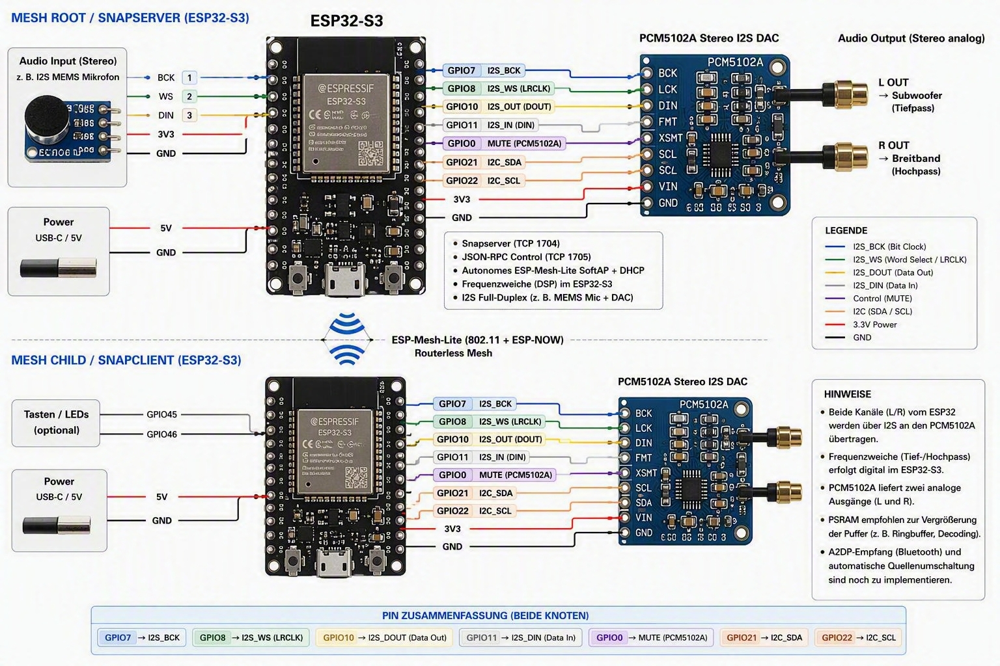

# ESP32-S3 Mini Snapserver

**Stand:** 2026-09-15

## Projektziel

Dieses Projekt implementiert einen eigenständigen **Snapcast-kompatiblen Audio-Server auf einem ESP32-S3**.

Der ESP32-S3 übernimmt dabei mehrere Aufgaben:

* Audioeingang über I2S
* Stereo-zu-Mono-Mischung
* Opus-Encoding
* Snapcast-kompatibler Audiostream
* TCP-Verbindung für Audio auf Port **1704**
* JSON-RPC-Steuerung auf Port **1705**
* eigenständiger ESP-Mesh-Lite-Root
* Verteilung des Audiosignals an Snapclients
* lokale digitale Frequenzweiche für die angeschlossene Audiohardware

Das Ziel ist ein vollständig eigenständiger Audio-Server ohne Raspberry Pi oder PC im laufenden Betrieb.



---

## Aktueller Funktionsumfang

* ESP32-S3 als Snapserver
* PSRAM-Unterstützung
* ESP-Mesh-Lite als eigenes Mesh-Netzwerk
* ESP32-S3 arbeitet als Mesh-Root
* I2S-Audioeingang
* Stereo-Eingang wird vor der weiteren Verarbeitung zu Mono gemischt
* Opus-Encoding
* Snapcast-Audiostream über TCP Port 1704
* Snapcast JSON-RPC über TCP Port 1705
* monotone Audiozeitbasis mit Abgleich mit der absoluten Client-Zeit
* Audioübertragung an normale Snapclients
* lokale digitale Frequenzweiche
* Ausgabe der getrennten Frequenzbereiche über I2S
* vorgesehen für die Kombination mit externen I2S-DACs und Verstärkern

---

## Hardware

### ESP32-S3

Der Server basiert auf einem ESP32-S3 mit PSRAM.

PSRAM ist in `sdkconfig.defaults` aktiviert (`CONFIG_SPIRAM=y`, Octal-Modus,
80 MHz) und steht für zukünftige Puffer und die DSP-Verarbeitung bereit.
Der aktuelle Code alloziert seine Audio-, Netzwerk- und Opus-Puffer noch im
internen RAM.

### Audioeingang

Als Audioquelle wird ein I2S-Audioeingang verwendet.

Aktuell vorgesehen:

**TinySine AudioB I2S V2r0**

Das Eingangssignal wird zunächst als Stereo verarbeitet und anschließend zu einem Monosignal gemischt.

### Audioausgang

Für die lokale Audioausgabe ist ein I2S-DAC vorgesehen:

**PCM5102A**

Das Ausgangssignal wird nach der digitalen Frequenzweiche entsprechend der jeweiligen Frequenzbereiche ausgegeben.

---

## Audioverarbeitung

Der grundsätzliche Signalweg ist:

```text
I2S Stereo Input
       │
       ▼
  L + R → Mono
       │
       ├──────────────► Opus Encoder
       │                     │
       │                     ▼
       │              Snapcast Stream
       │
       ▼
 Digitale Frequenzweiche
       │
       ├────────► Low Band
       │
       └────────► High Band
                     │
                     ▼
                 I2S DAC
```

Die Stereo-Kanäle werden **vor der Frequenzweiche** zu einem gemeinsamen Monosignal gemischt.

Damit wird ausdrücklich keine getrennte Frequenzweiche für den linken und rechten Kanal betrieben.

---

## Digitale Frequenzweiche

Die lokale DSP-Verarbeitung erfolgt direkt auf dem ESP32-S3.

Vorgesehen ist eine **Linkwitz-Riley-Frequenzweiche 4. Ordnung (LR4)**.

Die Frequenzweiche arbeitet auf dem zuvor aus L und R gebildeten Monosignal.

Beispiel:

```text
             Mono
               │
               ▼
        ┌────────────-──┐
        │     LR4       │
        │ Frequenzweiche│
        └──────────-────┘
             │     │
             │     │
             ▼     ▼
            LOW   HIGH
             │     │
             ▼     ▼
           Output Output
```

Die konkrete Trennfrequenz wird über die Projektkonfiguration festgelegt
(`CONFIG_SNAPSERVER_CROSSOVER_HZ`, Standard 120 Hz).

Die DSP-Verarbeitung benötigt für diesen Signalweg kein externes DSP-System.
Die Filter laufen als zwei kaskadierte Biquads (Butterworth, Q = 0,7071) pro
Zweig direkt auf dem ESP32-S3; PSRAM wird dafür nicht benötigt.

---

## Snapcast-Kompatibilität

Der ESP32-S3 stellt die für Snapcast benötigten Netzwerkdienste bereit.

### Audio

**TCP Port 1704**

Über diesen Port wird der Audiostream an die Snapclients übertragen.

### Steuerung

**TCP Port 1705**

Über diesen Port erfolgt die JSON-RPC-Kommunikation.

Damit kann sich beispielsweise ein normaler PC-Snapclient mit dem ESP32-S3 verbinden.

---

## Zeitbasis

Der ESP32-S3 besitzt in dieser Anwendung keine dauerhaft gültige Echtzeituhr (RTC) mit verlässlicher absoluter Zeit.

Deshalb verwendet der Server `esp_timer_get_time()` als monotone Zeitquelle und
addiert einen Offset (`s_wall_offset_us`), der die Wall-Clock-Domäne abbildet.

* Der Offset startet auf einem festen Epoch-Anker (2026-01-01) und wird
  einmalig neu gesetzt, sobald ein Client mit plausibler Wall-Clock-Zeit
  (nach 2024-01-01) sein erstes `Time`-Paket sendet.
* Uptime-basierte ESP-Clients werden dabei ignoriert, weil ihr Zeitstempel
  die Plausibilitätsgrenze nicht überschreitet.
* Nach dem ersten Abgleich bleibt der Offset fest (`s_clock_synced`), damit
  ein späterer Client die Zeitbasis während des Streamings nicht verschiebt.
* Nachrichtenheader und Audiochunks verwenden dieselbe Zeitdomäne.
* Audiozeitstempel beziehen sich auf den Beginn des jeweiligen PCM-Frames und
  werden aus einem fortlaufenden Sample-Zähler abgeleitet, nicht aus dem
  Rückgabezeitpunkt von `i2s_channel_read()`.

Ziel ist ein sauberer **Abgleich mit der absoluten Client-Zeit**, ohne die
Audiozeitbasis selbst von einer möglicherweise unstabilen Echtzeituhr
abhängig zu machen.

---

## Netzwerk

Der ESP32-S3 arbeitet als eigenständiger **ESP-Mesh-Lite-Root**.

Die Mesh-Struktur ermöglicht die Verbindung weiterer ESP-Geräte, ohne dass für die reine Audioverteilung zwingend ein separater Raspberry-Pi-Snapserver erforderlich ist.

Der Snapserver selbst stellt seine Dienste über das lokale Netzwerk beziehungsweise Mesh-Netzwerk bereit.

---

## Projektstruktur

Die Anwendungsquellen liegen vollständig unter `main/`:

```text
main/
├── app_main.c        Einstiegspunkt und Initialisierungsreihenfolge
├── mesh_root.c/.h    Autarker ESP-Mesh-Lite-Root (SoftAP + DHCP)
├── audio_i2s.c/.h    Full-Duplex-I2S, Mono-Mix, LR4-Frequenzweiche
├── audio_opus.c/.h   Opus-Encoder (20-ms-Frames, mono)
├── snapserver.c/.h   Snapcast-Binärprotokoll auf Port 1704
├── snapcontrol.c/.h  JSON-RPC-2.0-Control-Server auf Port 1705
├── Kconfig.projbuild menuconfig-Optionen
└── CMakeLists.txt

CMakeLists.txt
sdkconfig.defaults
partitions.csv
README.md
```

Die genaue Struktur kann sich während der Entwicklung noch ändern.

---
## Abhängigkeiten

Dieses Projekt verwendet Komponenten aus dem ESP-IDF-Ökosystem, darunter:

* **ESP-IDF** — Apache License 2.0
* **ESP-Mesh-Lite** — Apache License 2.0
* **ESP-IoT-Bridge** — Apache License 2.0
* **ESP-Modem** — Apache License 2.0
* **CMake Utilities** — Apache License 2.0
* **esp-opus** — MIT License

Die jeweiligen Drittanbieter-Komponenten unterliegen weiterhin ihren
ursprünglichen Lizenzbedingungen.

Für die vollständigen Lizenztexte und weitere Informationen wird auf die
jeweiligen Upstream-Repositories und den ESP-IDF-Komponenten-Registry
verwiesen.

---

## Build

ESP-IDF muss zunächst eingerichtet sein.

Danach im Projektverzeichnis:

```bash
idf.py set-target esp32s3
idf.py build
```

Flashen:

```bash
idf.py flash
```

Serielle Ausgabe:

```bash
idf.py monitor
```

Build und Monitor können auch kombiniert werden:

```bash
idf.py flash monitor
```

---


## Pinbelegung

Der I2S-Bus läuft als Full-Duplex-Master ohne MCLK. RX und TX teilen sich
BCLK und LRCLK, die Datenleitungen sind getrennt. Die Werte sind in
`main/audio_i2s.h` definiert.

| GPIO | Richtung | Signal | Gegenstelle |
|------|----------|--------|-------------|
| 4    | Ausgang  | BCLK   | PCM5102A BCK und TinySine BCLK |
| 6    | Ausgang  | LRCLK  | PCM5102A LCK und TinySine LRCLK |
| 5    | Eingang  | DIN    | TinySine SD OUT -> ESP32-S3 |
| 7    | Ausgang  | DOUT   | ESP32-S3 -> PCM5102A DIN |

---


## Entwicklungsstatus

Das Projekt befindet sich in aktiver Entwicklung.

Der Schwerpunkt liegt derzeit auf:

* stabiler Audioübertragung
* korrekter Snapcast-Synchronisation
* stabiler Zeitbasis
* ESP-Mesh-Lite-Integration
* DSP-Frequenzweiche
* zuverlässiger I2S-Verarbeitung
* möglichst geringer zusätzlicher Latenz

Änderungen an Audioformat, Buffergrößen, Filterparametern und Netzwerkverhalten sind während der Entwicklung möglich.

---

## Lizenz

MIT License
