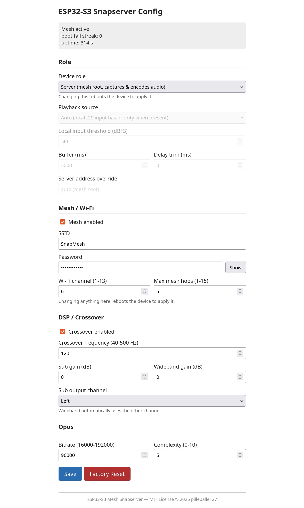
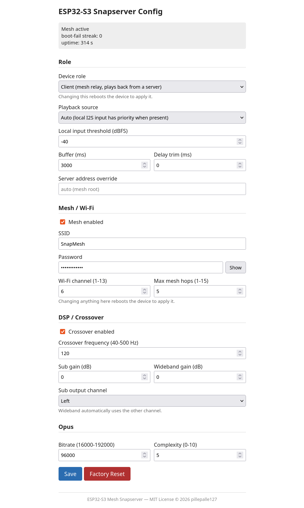

# ESP32-S3 Mini Snapserver

**Stand:** 2026-09-17

## Projektziel

Dieses Projekt implementiert ein eigenständiges **Snapcast-kompatibles Audiosystem auf ESP32-S3**,
das in einem eigenen ESP-Mesh-Lite-Netzwerk sowohl als **Server** als auch als **Client**
laufen kann — dieselbe Firmware, die Rolle wird per Web-Konfiguration gewählt.

Als **Server** übernimmt der ESP32-S3 mehrere Aufgaben:

* Audioeingang über I2S
* Stereo-zu-Mono-Mischung
* Opus-Encoding
* Snapcast-kompatibler Audiostream
* TCP-Verbindung für Audio auf Port **1704**
* JSON-RPC-Steuerung auf Port **1705**
* eigenständiger ESP-Mesh-Lite-Root
* Verteilung des Audiosignals an Snapclients
* lokale digitale Frequenzweiche für die angeschlossene Audiohardware
* Web-Konfigurationsoberfläche für Mesh-, DSP- und Opus-Einstellungen
* Provisioning-AP-Fallback, falls das Gerät sonst nicht erreichbar wäre

Als **Client** (siehe [Client-Rolle](#client-rolle)) tritt ein weiterer ESP32-S3 demselben
Mesh als Relay bei, empfängt den Snapcast-Stream des Servers und gibt ihn über dieselbe
DSP-/I2S-Kette an einem eigenen Lautsprecher wieder — wahlweise mit lokalem I2S-Eingang
als Alternativquelle.

Das Ziel ist ein vollständig eigenständiges Mehr-Lautsprecher-Audiosystem ohne Raspberry Pi
oder PC im laufenden Betrieb.

---

## Aktueller Funktionsumfang

* ESP32-S3 als Snapserver
* PSRAM-Unterstützung
* ESP-Mesh-Lite als eigenes Mesh-Netzwerk
* ESP32-S3 arbeitet als Mesh-Root
* I2S-Audioeingang
* Stereo-Eingang wird vor der weiteren Verarbeitung zu Mono gemischt
* Opus-Encoding
* Snapcast-Audiostream über TCP Port 1704
* Snapcast JSON-RPC über TCP Port 1705
* monotone Audiozeitbasis mit Abgleich mit der absoluten Client-Zeit
* Audioübertragung an normale Snapclients
* lokale digitale Frequenzweiche
* Ausgabe der getrennten Frequenzbereiche über I2S
* vorgesehen für die Kombination mit externen I2S-DACs und Verstärkern
* Web-Konfigurationsseite (HTTP, Port 80) für Mesh-Zugangsdaten, Mesh-Hop-Tiefe,
  DSP-Frequenzweiche (Enable, Trennfrequenz, Kanal-Gains, Kanalzuordnung) und
  Opus-Bitrate/Complexity, persistent in NVS gespeichert
* mDNS-Erreichbarkeit unter `snapserver.local`
* Factory-Reset über die Web-Oberfläche
* Offener Provisioning-Access-Point (`ESP32_provisioning_<MAC>`) als Fallback bei
  Erstinbetriebnahme, nach Factory-Reset, bei deaktiviertem Mesh oder nach
  mehreren erfolglosen Mesh-Boots
* Client-Rolle (Snapcast-Empfang, Mesh-Relay) über dieselbe Web-Konfiguration
  wählbar, siehe [Client-Rolle](#client-rolle)

---

## Hardware

### ESP32-S3

Der Server basiert auf einem ESP32-S3 mit PSRAM.

Die zusätzliche Speichergröße wird unter anderem für Audioverarbeitung, Netzwerk- und Opus-Puffer verwendet.

### Audioeingang

Als Audioquelle wird ein I2S-Audioeingang verwendet.

Aktuell vorgesehen:

**TinySine AudioB I2S V2r0**

Das Eingangssignal wird zunächst als Stereo verarbeitet und anschließend zu einem Monosignal gemischt.

### Audioausgang

Für die lokale Audioausgabe ist ein I2S-DAC vorgesehen:

**PCM5102A**

Das Ausgangssignal wird nach der digitalen Frequenzweiche entsprechend der jeweiligen Frequenzbereiche ausgegeben.

---

## Audioverarbeitung

Der grundsätzliche Signalweg ist:

```text
I2S Stereo Input
       │
       ▼
  L + R → Mono
       │
       ├──────────────► Opus Encoder
       │                     │
       │                     ▼
       │              Snapcast Stream
       │
       ▼
 Digitale Frequenzweiche
       │
       ├────────► Low Band
       │
       └────────► High Band
                     │
                     ▼
                 I2S DAC
```

Die Stereo-Kanäle werden **vor der Frequenzweiche** zu einem gemeinsamen Monosignal gemischt.

Damit wird ausdrücklich keine getrennte Frequenzweiche für den linken und rechten Kanal betrieben.

---

## Digitale Frequenzweiche

Die lokale DSP-Verarbeitung erfolgt direkt auf dem ESP32-S3.

Vorgesehen ist eine **Linkwitz-Riley-Frequenzweiche 4. Ordnung (LR4)**.

Die Frequenzweiche arbeitet auf dem zuvor aus L und R gebildeten Monosignal.

Beispiel:

```text
             Mono
               │
               ▼
        ┌────────────-──┐
        │     LR4       │
        │ Frequenzweiche│
        └──────────-────┘
             │     │
             │     │
             ▼     ▼
            LOW   HIGH
             │     │
             ▼     ▼
           Output Output
```

Trennfrequenz, Enable/Bypass, Kanal-Gains und Kanalzuordnung sind zur Laufzeit über
die Web-Konfigurationsseite änderbar (siehe unten) und wirken sofort, ohne Neustart.
Die Projektkonfiguration (Kconfig) legt dafür nur noch die Standardwerte für
Erstinbetriebnahme und Factory-Reset fest.

Die DSP-Verarbeitung benötigt für diesen Signalweg kein externes DSP-System und ist auf dem ESP32-S3 ohne zwingende Verwendung von PSRAM für die eigentliche Filterberechnung vorgesehen.

---

## Web-Konfiguration

Das Gerät stellt unter Port **80** eine Konfigurationsseite bereit, erreichbar über
seine IP-Adresse oder per mDNS unter `http://snapserver.local/`. Dieselbe Seite
läuft auf jedem Gerät, unabhängig von der Rolle — Screenshots beider Rollen
in [Client-Rolle](#client-rolle).



Konfigurierbar:

* **Rolle:** Server oder Client (siehe [Client-Rolle](#client-rolle)). Änderung
  löst einen Neustart aus.
* **Mesh / Wi-Fi:** Enable, SSID, Passwort, Kanal, maximale Hop-Tiefe
  (`esp_mesh_lite`-Level). Änderungen an diesen Werten lösen einen Neustart aus, um
  sie zu übernehmen.
* **DSP / Frequenzweiche:** Enable, Trennfrequenz, Gain pro Kanal, Kanalzuordnung
  (Sub/Wideband). Wirkt sofort, ohne Neustart. Gilt für beide Rollen — auch der
  Client führt sein wiedergegebenes Signal durch dieselbe Weiche.
* **Opus:** Bitrate, Complexity. Wirkt sofort, ohne Neustart. Nur in der
  Server-Rolle relevant (Encoder-Einstellungen).

Alle Werte werden persistent im NVS gespeichert und überleben Neustarts und
Firmware-Updates (solange sich das Konfigurationsschema nicht ändert).

Ein **Factory-Reset**-Button setzt die Konfiguration auf die Kconfig-Standardwerte
zurück und startet das Gerät neu.

### Provisioning-Access-Point

Ist das Gerät über sein konfiguriertes Mesh nicht erreichbar, öffnet es automatisch
einen offenen, unverschlüsselten Access Point (`ESP32_provisioning_<MAC>`), über
den dieselbe Konfigurationsseite erreichbar ist. Auslöser sind:

* Erstinbetriebnahme (noch keine gespeicherte Konfiguration)
* Factory-Reset
* Mesh in der Konfiguration deaktiviert
* 7 aufeinanderfolgende Boots ohne dass sich eine Station am eigenen Mesh-AP anmeldet

Der Provisioning-AP bleibt 3 Minuten aktiv; läuft dieses Fenster ab, ohne dass
gespeichert wurde, schaltet sich der Funk komplett ab — ein erneutes Fenster öffnet
sich erst nach einem Stromzyklus. Ein Speichern innerhalb des Fensters startet das
Gerät neu und übergibt an die normale Mesh-Entscheidung.

---

## Client-Rolle

Dieselbe Firmware kann statt als Server auch als Snapcast-**Client** laufen —
z. B. auf einem zweiten ESP32-S3 an einem anderen Lautsprecher im selben
Mesh. Umschaltbar über die Web-Konfiguration (Feld „Rolle", siehe
[Web-Konfiguration](#web-konfiguration)), Übernahme per Neustart.



In der Client-Rolle:

* Das Gerät tritt dem Mesh als **Non-Root-Relay** bei, niemals als Leaf —
  ein Leaf könnte in einer langgestreckten, mehrere Hops tiefen Topologie
  keine weiteren Kinder mehr annehmen und die Kette damit vorzeitig beenden.
* Der Snapserver wird automatisch über `esp_mesh_lite_get_root_ip()`
  gefunden (funktioniert auch über mehrere Hops und nach
  Mesh-Umstrukturierungen hinweg, anders als das lokale DHCP-Gateway oder
  mDNS, die beide nur bis zur ersten Ebene reichen). Alternativ ist in der
  Web-Konfiguration eine feste Server-Adresse eintragbar.
* Empfangenes Snapcast-Audio (Opus, mono) wird dekodiert und über dieselbe
  DSP-/I2S-Ausgabekette wie beim Server wiedergegeben.
* Der lokale I2S-Eingang steht als **alternative Audioquelle** zur
  Verfügung (z. B. Aux-Eingang) — per Pegelerkennung automatisch priorisiert,
  sobald dort ein Signal anliegt, oder über die Web-Konfiguration fest auf
  „nur Netzwerk" oder „nur lokaler Eingang" erzwingbar.
* Puffergröße (`bufferMs`) und ein zusätzlicher Delay-Trim sind konfigurierbar,
  um Mesh-Umstrukturierungen in einem dynamischen Funkumfeld zu überbrücken.

**Bekannte Einschränkung (Stand dieser Version):** Es findet noch kein
Zeitabgleich mit dem Server statt (`SNAP_MSG_TIME` wird vom Client noch nicht
gesendet). Ein einzelner Client spielt Audio flüssig ab, aber mehrere Clients
gleichzeitig können über längere Zeit gegeneinander driften. Ein
Drift-Ausgleich ist als nächster Schritt vorgesehen.

---

## Snapcast-Kompatibilität

Der ESP32-S3 stellt die für Snapcast benötigten Netzwerkdienste bereit.

### Audio

**TCP Port 1704**

Über diesen Port wird der Audiostream an die Snapclients übertragen.

### Steuerung

**TCP Port 1705**

Über diesen Port erfolgt die JSON-RPC-Kommunikation.

Damit kann sich beispielsweise ein normaler PC-Snapclient mit dem ESP32-S3 verbinden.

---

## Zeitbasis

Der ESP32-S3 besitzt in dieser Anwendung keine dauerhaft gültige Echtzeituhr (RTC) mit verlässlicher absoluter Zeit.

Deshalb verwendet der Server `esp_timer_get_time()` als monotone Zeitquelle und ergänzt einen Laufzeit-Offset.

* Uptime-basierte ESP-Clients werden nicht als Quelle für die absolute Zeit verwendet.
* Eine plausible Epoch-Zeit kann von einem PC- oder Android-Client übernommen werden.
* Nachrichtenheader und Audiochunks verwenden dieselbe monotone Zeitbasis.
* Audiozeitstempel beziehen sich auf den Beginn des jeweiligen PCM-Frames.

Ziel ist ein sauberer **Abgleich mit der absoluten Client-Zeit**, ohne die Audiozeitbasis selbst von einer möglicherweise unstabilen Echtzeituhr abhängig zu machen.

---

## Netzwerk

Im Normalbetrieb arbeitet der ESP32-S3 als eigenständiger **ESP-Mesh-Lite-Root**.

Die Mesh-Struktur ermöglicht die Verbindung weiterer ESP-Geräte, ohne dass für die reine Audioverteilung zwingend ein separater Raspberry-Pi-Snapserver erforderlich ist.

Der Snapserver selbst stellt seine Dienste über das lokale Netzwerk beziehungsweise Mesh-Netzwerk bereit.

Ist das Mesh nicht erreichbar oder nicht konfiguriert, fällt das Gerät automatisch
auf einen offenen Provisioning-Access-Point zurück (siehe [Web-Konfiguration](#web-konfiguration)),
damit es niemals dauerhaft unerreichbar wird. Das gilt für beide Rollen: auch
ein als Client konfiguriertes Gerät, das keinen Parent findet, fällt auf den
Provisioning-AP zurück statt dauerhaft unerreichbar zu bleiben.

Weitere Geräte können dem Mesh als **Client** beitreten und dort empfangenes
Audio wiedergeben, siehe [Client-Rolle](#client-rolle).

---

## Projektstruktur

Die wichtigsten Komponenten befinden sich unter anderem in:

```text
components/
├── audio_i2s/
│   ├── CMakeLists.txt
│   ├── audio_i2s.c
│   └── include/
│
├── ...
│
main/
├── ...
│
CMakeLists.txt
sdkconfig
README.md
```

Die genaue Struktur kann sich während der Entwicklung noch ändern.

---
## Abhängigkeiten

Dieses Projekt verwendet Komponenten aus dem ESP-IDF-Ökosystem, darunter:

* **ESP-IDF** — Apache License 2.0
* **ESP-Mesh-Lite** — Apache License 2.0
* **ESP-IoT-Bridge** — Apache License 2.0
* **ESP-Modem** — Apache License 2.0
* **ESP-mDNS** — Apache License 2.0
* **CMake Utilities** — Apache License 2.0
* **esp-opus** — MIT License

Die jeweiligen Drittanbieter-Komponenten unterliegen weiterhin ihren
ursprünglichen Lizenzbedingungen.

Für die vollständigen Lizenztexte und weitere Informationen wird auf die
jeweiligen Upstream-Repositories und den ESP-IDF-Komponenten-Registry
verwiesen.

---

## Build

ESP-IDF muss zunächst eingerichtet sein.

Danach im Projektverzeichnis:

```powershell
idf.py set-target esp32s3
idf.py build
```

Flashen:

```powershell
idf.py flash
```

Serielle Ausgabe:

```powershell
idf.py monitor
```

Build und Monitor können auch kombiniert werden:

```powershell
idf.py flash monitor
```

---


## Pining

GPIO 4   ESP32-S3 -> PCM5102A BCK und TinySine BCLK

GPIO 6   ESP32-S3 -> PCM5102A LCK und TinySine LRCLK

GPIO 5   TinySine DOUT -> ESP32-S3 DIN

GPIO 7   ESP32-S3 DOUT -> PCM5102A DIN

---


## Entwicklungsstatus

Das Projekt befindet sich in aktiver Entwicklung.

Der Schwerpunkt liegt derzeit auf:

* stabiler Audioübertragung
* korrekter Snapcast-Synchronisation
* stabiler Zeitbasis
* ESP-Mesh-Lite-Integration
* DSP-Frequenzweiche
* zuverlässiger I2S-Verarbeitung
* möglichst geringer zusätzlicher Latenz

Änderungen an Audioformat, Buffergrößen, Filterparametern und Netzwerkverhalten sind während der Entwicklung möglich.

---

## Lizenz

MIT License
