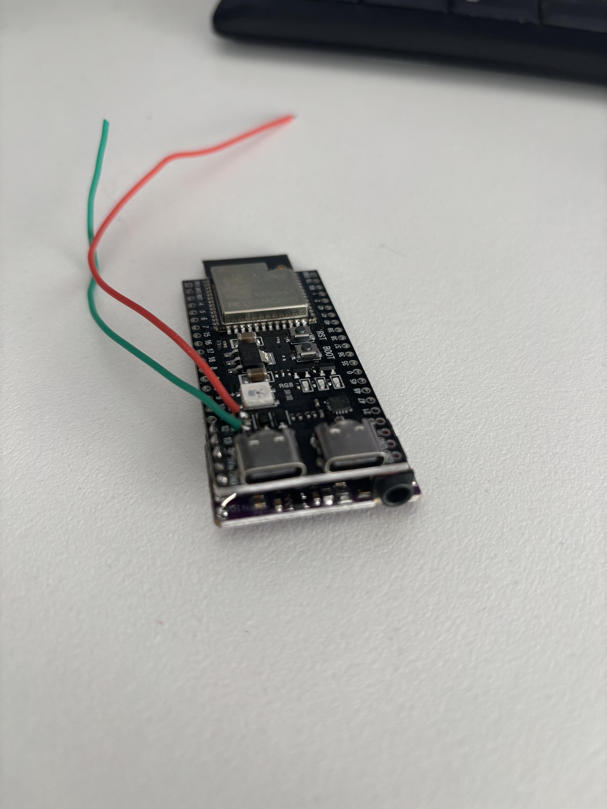
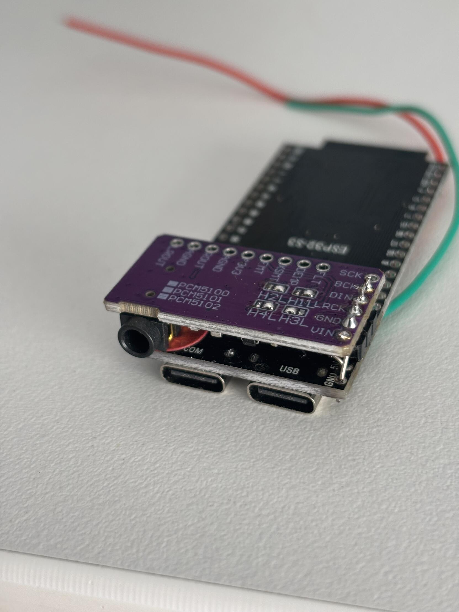
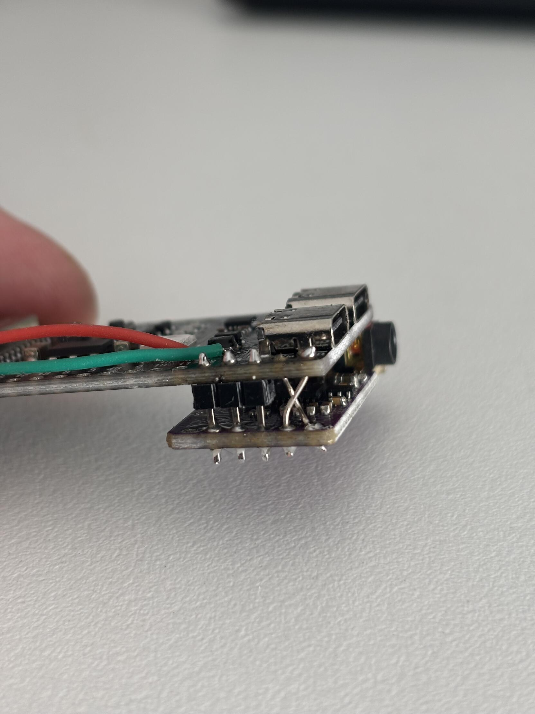
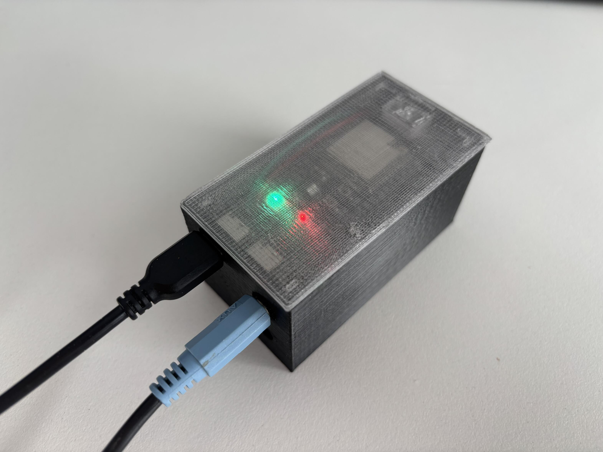
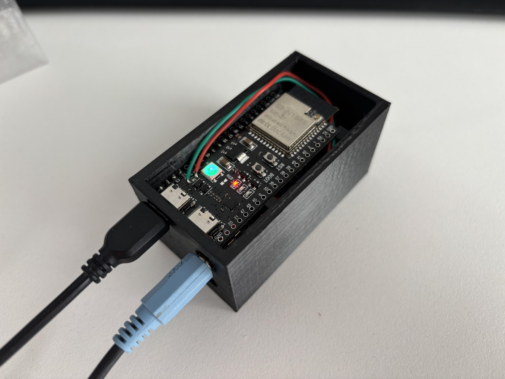
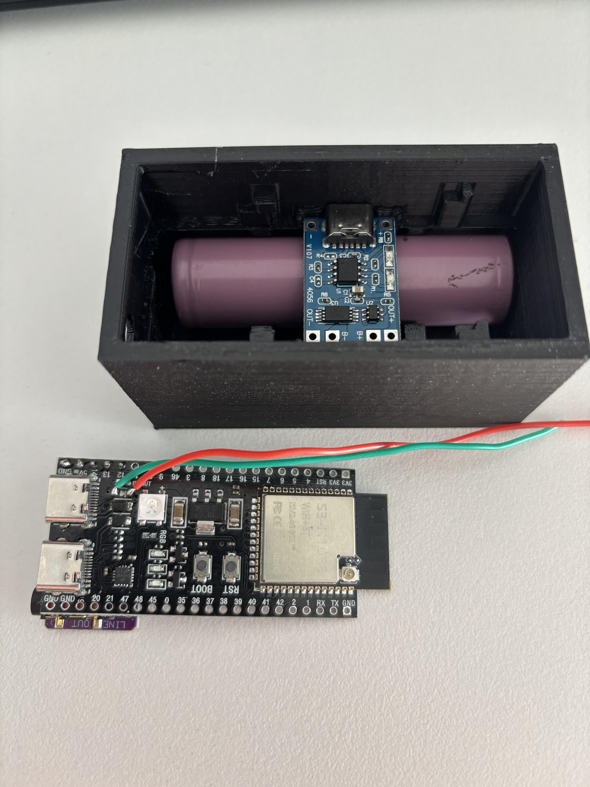
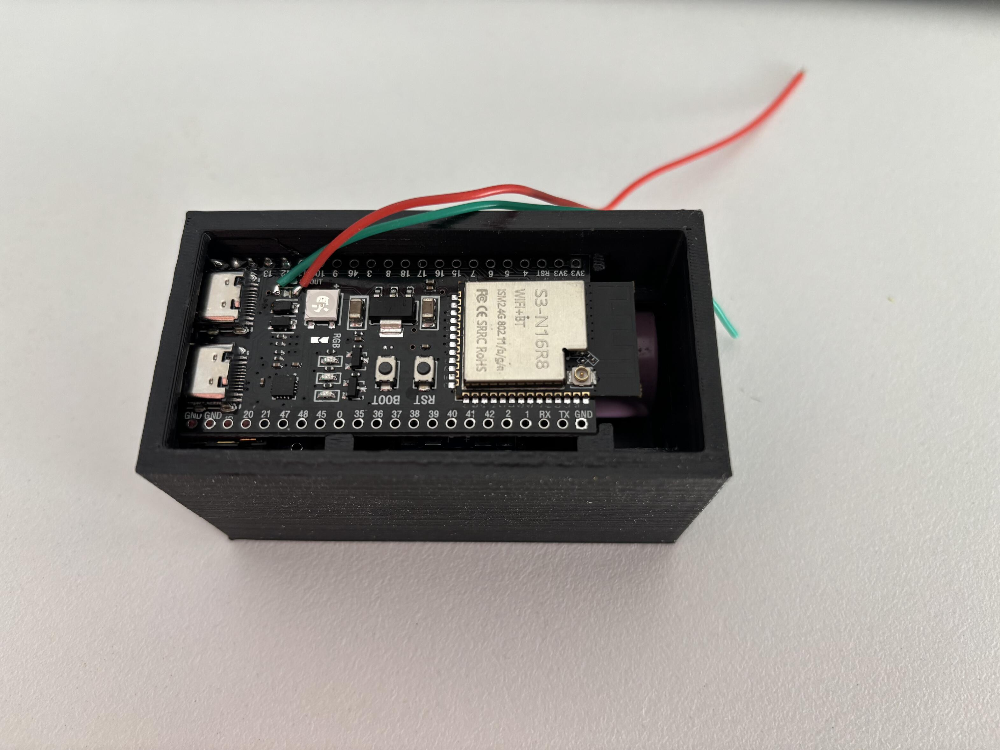
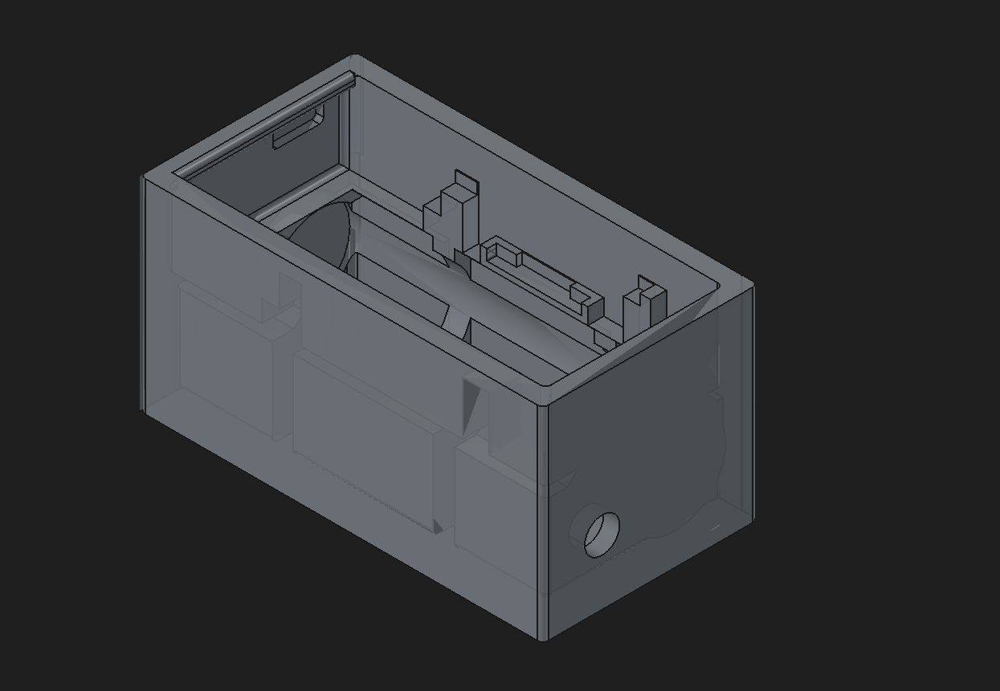
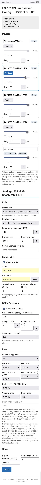
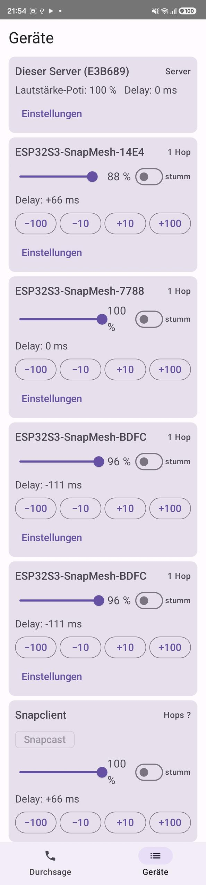

<picture>
  <source media="(prefers-color-scheme: dark)" srcset="docs/logo/snapmesh-logo-dark.svg">
  
</picture>

# ESP32-S3 Mesh Snapserver

**Stand:** 2026-09-26

Snapcast-kompatibles Mehrraum-Audiosystem auf ESP32-S3. Eine Firmware, zwei Rollen, zur Laufzeit per
Web-Konfiguration umschaltbar:

* **Server:** ESP-Mesh-Lite-Root. Nimmt I2S-Stereo auf, mischt zu Mono, encodiert Opus, streamt per Snapcast an
  alle Clients und spielt zeitversetzt synchron auf dem eigenen Lautsprecher mit.
* **Client:** Mesh-Relay (nie Leaf). Empfängt den Stream, synchronisiert auf die Serveruhr, gibt ihn über dieselbe
  DSP/I2S-Kette aus; wahlweise mit lokalem I2S-Eingang als Alternativquelle.

Offizielle Snapclients (PC, Android, iOS) und Snapcast-Control-Apps funktionieren ebenfalls.

---

## Installation

Ohne Toolchain: Firmware per Browser, App als APK, beide automatisch gebaut unter
[Releases](https://github.com/pillepalle127/ESP32S3_Mesh_Snapserver/releases).

**Du brauchst:**

* **Ein ESP32-S3-Board je Standort** (z. B. Lautsprecher plus Subwoofer über die Weiche) mit **≥ 4 MB Flash und
  Octal-PSRAM**, etwa „N16R8“/„N8R8“ (YD-ESP32-S3 N16R8). Mit Quad-PSRAM (N8R2, N16R2) oder ohne PSRAM (N16)
  startet die Firmware nicht; die Bezeichnung steht beim Produkt oder auf dem Modul.
* **USB-Datenkabel** (reine Ladekabel gehen nicht), **PC mit Chrome oder Edge**
  (Windows, macOS, Linux; nicht Firefox, Safari, Handy).
* Für die App **Android** ab 8; iPhones nutzen die Einstellungen im Browser.

### 1. Firmware aufspielen

1. **[Flash-Seite](https://pillepalle127.github.io/ESP32S3_Mesh_Snapserver/)** in Chrome/Edge öffnen.
2. Board anschließen, bei zwei Buchsen die am ESP32-S3 (meist „USB“, nicht „COM“/„UART“).
3. **Installieren** → **„USB JTAG/serial debug unit“** → **Verbinden**.
4. Neues Board: „Erase device“ erlaubt. **Update: „Erase device“ nicht anhaken**, dann bleiben alle Einstellungen.
5. Etwa eine Minute warten, Kabel stecken lassen; nach „Installation complete“ startet das Board neu.

Board fehlt: anderes Kabel/andere Buchse, sonst **BOOT** halten, **RST** tippen, BOOT loslassen; unter Linux
Gruppe `dialout`.

### 2. Neues Gerät einrichten

Ein frisch installiertes Board öffnet das offene WLAN **`ESP32_provisioning_…`**.

1. Verbinden (auch bei „kein Internet“), **http://192.168.5.1/** öffnen.
2. **Rolle:** **Server** für genau das Gerät mit der Musikquelle (TinySine-Eingang), **Client** für alle anderen.
   **Mesh:** Name und Passwort, **auf allen Geräten gleich**. **Pins:** nur bei abweichender Verdrahtung
   ([Standardbelegung](#hardware)); Vorlage „Alternative“ = zweite übliche Belegung.
3. **Save**: Neustart, das Gerät verbindet sich mit dem Mesh.

Erst Server, dann Clients (jeder erscheint in der Geräteliste); danach im Mesh-WLAN **http://192.168.5.1/**: Lautstärke, Mute, Verzögerung je Gerät,
über **Settings** die Einstellungen jedes Clients.

### 3. Updates

Wie Schritt 1 **ohne „Erase device“**, jedes Gerät einzeln per USB; Einstellungen bleiben. Version im Statusfeld
(`firmware: v…`).

### 4. App installieren (Android)

1. Auf dem Handy **`SnapAnnounce-….apk`** von der [Release-Seite](https://github.com/pillepalle127/ESP32S3_Mesh_Snapserver/releases)
   laden, öffnen, Installieren aus dem Browser **erlauben**.
2. Im Mesh-WLAN die App öffnen (Server `192.168.5.1` voreingestellt). **Durchsage:** Knopf drücken, sprechen,
   erneut drücken. **Geräte:** Lautstärke, Mute, Verzögerung aller Lautsprecher; **Einstellungen** öffnet die
   Konfiguration eines Geräts.

Rechte: **Mikrofon** („Während der Nutzung“; ohne keine Durchsagen, Geräteliste geht trotzdem) und ab Android 13 **Benachrichtigungen**
(**Zulassen**: zeigt das offene Mikrofon auch gesperrt, mit Beenden). Netzwerk, WLAN-Lock und Vordergrunddienst
gibt es ohne Nachfrage; Standort, Kontakte, Speicher, Kamera nicht nötig. Nachholen: Einstellungen → Apps →
SnapAnnounce → Berechtigungen. Selbst gebaute App vorher deinstallieren (andere Signatur); danach installieren
sich neue Versionen darüber.

### Alternativ: Flashen mit esptool

Auch ohne Chrome/Edge, mit dem eigenständigen [esptool](https://github.com/espressif/esptool/releases) (ohne
Python) und den vier Release-Dateien:
```bash
esptool --chip esp32s3 --before usb_reset write_flash 0x0 bootloader.bin 0x8000 partition-table.bin 0x10000 snapmesh-app.bin 0x3d0000 ota_data_initial.bin
```
`ota_data_initial.bin` setzt den OTA-Bereich zurück, damit die neue App startet. `snapmesh-full.bin` (Gesamt-Image
ab `0x0`) überschreibt NVS und PHY-Daten (`0x9000–0xFFFF`) mit `0xFF`: nur für Neuinstallationen.

---

## Funktionen

| Bereich | Umsetzung |
|---|---|
| Betrieb | Eigenständig: Auch der Server läuft auf einem ESP32-S3, kein PC oder Raspberry Pi nötig |
| Audio | I2S-Vollduplex 48 kHz, L+R → Mono, Opus (Vorgabe 96 kbit/s, Complexity 5) |
| DSP | LR4-Frequenzweiche (2 × Biquad je Zweig), Gain je Zweig, Kanalzuordnung, live änderbar |
| Sync | Vierzeiten-Zeitabgleich (Minimum-RTT aus 12 Messungen), Drift-Regelung per Resampling |
| Netz | ESP-Mesh-Lite, NAPT zwischen den Ebenen, Provisioning-AP als Rückfall |
| Steuerung | Web-UI + JSON-API (Port 80), Snapcast JSON-RPC (Port 1705), mDNS |
| Geräte | Geräteliste mit Lautstärke, Mute, Delay, Hops; Einstellungen jedes Clients über den Server |
| Hardware | Pinbelegung (I2S, LED, Potis) zur Laufzeit, Potis für Lautstärke und Delay, WS2812-Status-LED |
| Durchsagen | Android-App → UDP 1706, ~90 ms Latenz, Musik pausiert währenddessen |

---

## Hardware

Zwei Bauformen:

* **Komplettsystem** (im Verstärker integriert): Ausgang PCM5102A, Eingang TinySine AudioB I2S V2r0 (Bluetooth)
  über Pegelwandler TXB0104 ([Module an den Schnittstellen](#module-an-den-schnittstellen)).
* **[SnapStreamer](#aufbau-der-snapstreamer)**: nur PCM5102A, als zusätzliche Quelle an einem vorhandenen Verstärker.

ESP32-S3 mit ≥ 4 MB Flash und Octal-PSRAM (N16R8, N8R8; USB-Serial/JTAG), z. B. YD-ESP32-S3 N16R8 von VCC-GND
Studio ([Schaltplan V1.4](https://github.com/vcc-gnd/YD-ESP32-S3/blob/main/5-public-YD-ESP32-S3-Hardware%20info/YD-ESP32-S3-SCH-V1.4.pdf)).
Optional 2 × 10-kΩ-Poti und WS2812-LED. Standardbelegung (änderbar, siehe [Pins](#pins)):

| GPIO | Funktion |
|---|---|
| 4 | BCLK (PCM5102A BCK, TinySine BCLK) |
| 6 | LRCLK (PCM5102A LCK, TinySine LRCLK) |
| 5 | DIN ← TinySine DOUT |
| 7 | DOUT → PCM5102A DIN |
| 10 | Lautstärke-Poti (Schleifer) |
| – | Delay-Poti (Vorgabe: keiner) |
| 48 | WS2812-Status-LED |

---

## Aufbau: der SnapStreamer

Der **SnapStreamer** ist ein Client im eigenen Gehäuse mit Akku: ESP32-S3-Board mit PCM5102A darunter, als
weitere Quelle per Klinke (Line-Out) an einem vorhandenen Verstärker, ohne eigenen Eingang.





Der PCM5102A sitzt über kurze Stiftleisten direkt unter dem Board (wenig Platz und Lötarbeit); LEDs bleiben sichtbar,
RST und BOOT zugänglich, Klinke und USB liegen auf einer Ebene an einer Stirnseite (vereinfacht das Gehäuse). GND und VIN werden gekreuzt
(Seitenansicht: X).

Rote und grüne Leitung (optional) führen den aufgetrennten Strompfad der ESP-USB-Buchse zum TP4056: Über diese
eine Buchse wird kommuniziert und die 18650 geladen, auch bei ausgeschaltetem ESP; die Buchse des Lademoduls
bleibt ungenutzt. Ein **Poti mit Schalter** schaltet den ESP und regelt die Lautstärke ([Potis](#potis)).

### Stückliste

| Teil | Typ / Hinweis | Anzahl |
|---|---|---|
| ESP32-S3-Board | YD-ESP32-S3 N16R8 (≥ 4 MB Flash, Octal-PSRAM), mit U.FL-Anschluss | 1 |
| WLAN-Antenne | 2,4 GHz mit U.FL-(IPEX-)Kabel | 1 |
| DAC-Modul | PCM5102A mit 3,5-mm-Klinkenbuchse | 1 |
| Stiftleisten | 2,54 mm, DAC ↔ ESP-Board | 1 Satz |
| Lademodul | TP4056 mit Schutzschaltung (DW01), USB-C | 1 |
| Akku | 18650 Li-Ion mit Zellkontakten | 1 |
| Poti mit Schalter | 10 kΩ linear (B10K), Schalter für den Strompfad; Drehknopf | 1 |
| Widerstand | 1 kΩ, Schleifer → GPIO (Schutz, siehe [Potis](#potis)) | 1 |
| Litze | USB → TP4056, Akku, Schalter, Poti | – |
| Gehäuse | 3D-Druck: Unterteil (PETG), Deckel (PETG transparent) | 1 |

### Gehäuse








Unten Zelle und TP4056, darüber die Platine; USB-C und Klinke an der Stirnseite, die LED scheint durch den
Deckel. Konstruktionsdaten in
[`mechanics/housing/`](mechanics/housing/): `Snapstreamer2.FCStd` (FreeCAD-Modell),
`Snapstreamer2-SStreamer GuT.3mf` (Unterteil) und `Snapstreamer2-SStreamer GoT.3mf` (Deckel), beide druckfertig.

---

## Module an den Schnittstellen

### Ausgang: PCM5102A

TI-DAC mit Ladungspumpe: Line-Ausgang um Masse, ohne Koppelkondensatoren, **2,1 V<sub>eff</sub>** aus 3,3 V
(passt z. B. zum **TPA3255**), Last ab ~1 kΩ = **etwa 8 Verstärkereingänge** à ~10 kΩ. Ohne MCLK erzeugt er den
Takt per PLL aus BCK; SCK frei (auf GND per Lötbrücke störfester, meist unnötig), FMT auf GND (I2S), XSMT High.

### Eingang: TinySine AudioB I2S

Bluetooth-Empfänger (48 kHz, 16 Bit, u. a. **aptX**; Klang, Reichweite dank eigener Antenne und Verbindung sehr
gut), hier **I2S-Slave** am Takt des ESP.

Seine **1,8-V-Pegel** reichen dem ESP32-S3 nicht sicher („High“ laut Datenblatt ab ~2,5 V, Abtastung knapp an
der Flanke): Direkt an DIN kippen je nach Start Bits, hörbar als Rauschen/Knacksen, das kommt und geht (ohne
Wandler 3 von 9 Starts gestört, mit 0 von 24). Am **ADAU1701** läuft er erfahrungsgemäß ohne Wandler. Am ESP
hilft ein **TXB0104** (PCM5102A bleibt direkt am ESP):

| TXB0104 | anschließen an |
|---|---|
| VCCA | 1,8 V (Seite TinySine) |
| VCCB | 3,3 V (Seite ESP) |
| OE | VCCA |
| A1 ↔ B1 | TinySine BCK ↔ ESP BCLK |
| A2 ↔ B2 | TinySine LRCK ↔ ESP LRCLK |
| A3 ↔ B3 | TinySine SD ↔ ESP DIN |
| A4 | GND |

Nach einer Wiedergabe treibt der TinySine SD einige Sekunden nicht; ein Pull-down der Firmware hält DIN fest
(`TODO.md`, Fehler A und C).

---

## Signalweg

```text
I2S in (Stereo) ─► L+R → Mono ─┬─► Opus ─► Snapcast TCP 1704 ─► Clients
                               │
                               └─► Delay-Line (bufferMs + trim) ─► LR4 ─► Low/High ─► Gain/Vol ─► I2S out
```

Weiche mono; die lokale Ausgabe des Servers läuft um `bufferMs + delay_trim_ms` verzögert synchron zu den
Clients, der Stream unverzögert; die Poti-Lautstärke wirkt nur am Ausgang.

---

## Synchronisation (Client)

* Zeitabgleich über `SNAP_MSG_TIME`, gültig ist die kleinste RTT aus 12 Messungen (Mitteln zählte verzögerte mit).
* Soll-Zeit je Chunk `ts − offset + bufferMs − latency + delay_trim_ms` gegen `esp_timer` + 40 ms DMA-Latenz.
* Fehler > 100 ms: harter Resync (Überspringen bzw. Stille); darunter PI-Regler aufs Resampling-Verhältnis,
  ±500 ppm, Slew 5 ppm je 20-ms-Frame, Resampler mit 32.32-Phasenakkumulator.
* Ringpuffer 2 × `bufferMs` (PSRAM), Start ab 80 % Soll-Füllung.
* Gemessen: Regelfehler wenige ms; Synchronität mehrerer Clients über Stunden noch nicht nachgemessen.

Ohne RTC/SNTP nutzt der Server `esp_timer` plus Offset; eine plausible Wanduhr (> 2024) übernimmt er einmalig vom
ersten PC-/Android-Client (ESP-Clients melden nur Uptime und werden ignoriert).

---

## Netzwerk

| Port | Proto | Zweck |
|---|---|---|
| 80 | TCP | Web-UI, JSON-API |
| 1704 | TCP | Snapcast-Stream; zusätzlich Konfig-Kanal Server → eigene Clients |
| 1705 | TCP | Snapcast JSON-RPC, `Voice.Start`/`Voice.Stop` |
| 1706 | UDP | Durchsagen (Handy → Server → Clients) |

* NAPT trennt die Ebenen: ab Ebene 3 (2 Hops) ist ein Client nicht adressierbar, alle Wege zu ihm laufen über
  von ihm aufgebaute Verbindungen.
* Server-Suche über `esp_mesh_lite_get_root_ip()` (alle Ebenen, anders als DHCP-Gateway oder mDNS), feste Adresse
  einstellbar.
* mDNS: `snapserver-<MAC>.local` / `snapclient-<MAC>.local` (letzte 3 Bytes der Grund-MAC, wie bei esptool).
* WLAN-Powersave aus (`WIFI_PS_NONE`); Fusion-Intervall 20 s, damit eine Mesh-Insel nach Root-Ausfall zurückfindet.

### Provisioning-AP

Offener AP `ESP32_provisioning_<MAC>` mit derselben Web-UI, bei fehlender Konfiguration, nach Factory Reset,
bei deaktiviertem Mesh oder nach 7 Boots ohne Station am Mesh-AP. Nach 3 min ohne Speichern Funk aus (neu erst nach
Power-Cycle); Speichern startet neu.

### Snapcast-Erweiterungen

Alle Felder optional; fremde Clients und Server ignorieren sie. Fremde Clients bekommen während einer Durchsage
`muted:true`, da sie den UDP-Kanal nicht empfangen.

| Wo | Feld | Bedeutung |
|---|---|---|
| Hello | `"SnapMesh":1` | eigener Client: versteht `announcement` und Nachrichtentyp 100 |
| Hello | `"MeshLevel":n` | Mesh-Ebene (Root = 1), ergibt die Hops |
| ServerSettings | `"announcement":bool` | Durchsage läuft, Musik pausieren |
| Nachrichtentyp 100 | JSON-Request/Antwort | Konfig-Anfrage Server → Client, `refersTo` = Request-ID |
| `Server.GetStatus` | `"snapmesh":{"hops","own"}` | Hops und Herkunft je Client |

---

## Web-UI und API

Port 80 auf jedem Gerät; alle Werte im NVS, sie überleben Updates.



| Gruppe | Felder | Übernahme |
|---|---|---|
| Rolle | Server/Client | Neustart |
| Client-Wiedergabe | Quelle (Auto/Netz/lokal), Eingangsschwelle, `buffer_ms` (200–10000), Delay-Trim (±2000 ms), Server-Adresse | sofort; `buffer_ms` Neustart |
| Mesh | Enable, SSID, Passwort, Kanal (1–13), max. Hops (1–15) | Neustart |
| DSP | Enable, Trennfrequenz (40–500 Hz), Gain Sub/Wideband (−24…+12 dB), Sub-Kanal | sofort |
| Pins | I2S, LED, Potis, Delay-Poti-Bereich | Neustart; Bereich sofort |
| Opus | Bitrate (16–192 kbit/s), Complexity (0–10) | sofort, nur Server |

Kconfig liefert nur Vorgaben für ersten Start und Factory Reset (siehe [Build](#build)). Factory Reset setzt
Konfiguration, Pins, Potis und gespeicherte Client-Werte zurück.

### Geräteliste (Server)

Je Lautsprecher (oben auf der Server-Seite) **Name** (inline umbenennbar), **Hops**, **Lautstärke**, **Mute**, **Delay** (ms, positiv =
später; intern Snapcast-`latency` negiert), sofort wirksam; je Client-ID (MAC) im NVS (`client_store.c`, max. 24,
LRU), bei jedem Hello wieder eingespielt, auch Werte aus Control-Apps.

**Settings** lädt die Einstellungen eines Geräts ins Formular (Überschrift zeigt den Namen), Speichern geht an
dieses Gerät, in jeder Mesh-Tiefe: Nachrichtentyp 100 über dessen
Snapcast-Verbindung (`snapserver_remote_request()` → `webconfig_handle_remote_request()`); nach einem Neustart
„not connected“, Neuladen bei Rückkehr; Factory Reset nur lokal. Fremde Clients: Badge „Snapcast“, nur
Lautstärke/Mute/Delay, Hops = 1 bei MAC direkt am Server-AP, sonst unbekannt.

### Endpunkte

| Methode | Pfad | Inhalt |
|---|---|---|
| GET/POST | `/api/config` | Konfiguration; POST antwortet `{"reboot":bool}` |
| GET | `/api/status` | Provisioning-Grund, Uptime, Poti-Werte, Pin-Probestatus, Server-Verbindung (Client) |
| POST | `/api/factory-reset` | Reset + Neustart |
| GET | `/api/devices` | Geräteliste (nur Server) |
| POST | `/api/devices` | `{"id", "volume_percent"\|"muted"\|"delay_ms"\|"name"}` |
| GET/POST | `/api/devices/config?id=` | `/api/config` eines Clients über den Server |
| GET | `/api/devices/status?id=` | `/api/status` eines Clients über den Server |

Fehler bei `?id=`: 404 = nicht verbunden bzw. kein eigener Client, 504 = keine Antwort (3 s, Status 2 s),
400 = vom Client abgelehnt.

---

## Pins

Belegung zur Laufzeit unter *Pins*, ohne Neu-Flashen:

* I2S BCLK/LRCLK/DIN/DOUT immer belegt; LED und Potis dürfen „none“ sein.
* Vorlagen *Standard* 4/6/5/7, *Alternative* 17/8/5/18; kollidierende LED/Potis werden „none“.
* Ein Pin je Funktion; die Firmware prüft die Belegung beim Speichern erneut, auch per API.
* **Probestart:** Eine geänderte Belegung zählt je Boot hoch und wird nach vollständigem Start bestätigt
  (`device_config_confirm_pins()`); nach 3 unbestätigten Boots gilt wieder die Standardbelegung, gemeldet im
  Status. Falsch verdrahtete, aber zulässige Belegungen erkennt die Firmware nicht.

| Gesperrte GPIOs (`pinmap.c`) | Grund |
|---|---|
| 0, 3, 45, 46 | Strapping |
| 19, 20 | USB |
| 22–25 | nicht vorhanden |
| 26–32 | SPI-Flash, PSRAM-CS |
| 33–37 | Octal-PSRAM (`CONFIG_SPIRAM_MODE_OCT`) |
| 43, 44 | UART0-Konsole (falls aktiv) |

### Potis

10 kΩ zwischen 3V3 und GND, Schleifer an **ADC1 (GPIO 1–10)**, da ADC2 bei WLAN nicht lesbar ist (frei bei
Standardbelegung: 1, 2, 8, 9, 10). **1 kΩ vor dem GPIO** empfohlen, nicht nötig (0,33 mA, hochohmig): Er schützt
vor Kurzschluss am Anschlag, falls der Pin versehentlich Ausgang wird, und verschiebt mit dem internen
Pull-up/-down (~45 kΩ) einen Anschlag um ~2 %.

* **Lautstärke** (Vorgabe GPIO 10): Pull-up (ohne Poti 100 %), kubisch, mal Snapcast-Lautstärke, nur lokal.
* **Delay** (Vorgabe: keiner): ersetzt Delay-Trim, linear, Mitte 0 ms, Anschläge ±Bereich (Vorgabe 200 ms, max.
  2000 ms); Pull-down, offener Pin = negativer Anschlag.
* Abtastung alle 50 ms, Mittel aus 16, ~1 % Totband (außer an den Anschlägen), Lautstärke über 20 ms
  eingeblendet; Fehler durch Pull-up/-down ±2,6 % mittig, an den Enden exakt.
* Delay-Sprünge > 100 ms: harter Resync auf Clients, kleinere regelt die Drift aus (≤ 0,5 ms/s). Ohne ADC:
  Lautstärke 100 %, Delay = Feldwert.

### Status-LED

WS2812 (Vorgabe GPIO 48) für Zustand und Pegel. Beim Start blitzt sie rot, grün, blau (Selbsttest; fehlt er,
stimmt der LED-Pin nicht).

| Anzeige | Bedeutung |
|---|---|
| weiß, gedimmt | Start |
| blau, blinkt langsam (~2 s) | Provisionierung: offenes WLAN `ESP32_provisioning_…` |
| rot, blinkt schnell (~0,25 s) | kein Netz (Client) |
| orange, blinkt (~1 s) | Netz, aber kein Snapserver (Client) |
| Pegelanzeige | Wiedergabe |
| Pegelanzeige, alle ~3 s kurz dunkel | lokaler Eingang (A2DP) ohne Serververbindung |
| Pegelanzeige, pulsiert schnell (~0,5 s) | Sprachdurchsage |

Vorrang: Provisionierung > Durchsage > lokaler Eingang > Verbindung (lokaler Eingang ohne Server zeigt also
Pegel statt Orange). **Pegel:** Farbe Grün → Gelb → Rot, Helligkeit ab 30 %; RMS je 20 ms **vor** der Lautstärke
(Client: vor Snapcast-Lautstärke, Server: vor Weiche, Poti, lokaler Lautstärke), also auch bei leiser oder
stummer Box. Skala −35 dBFS bis −6 dBFS, sofortiger Anstieg, Abklingen ~100 ms (`LED_LEVEL_FLOOR_DB`/
`LED_LEVEL_CEIL_DB` in `status_led.c`).

---

## Sprachdurchsagen

Eigener Kanal, Latenz vor Lückenlosigkeit: `Voice.Start` über JSON-RPC 1705 (TCP, sicherer Start/Stopp), dann
Opus 16 kHz mono (~25 kbit/s) per UDP an Port 1706. Der Server spielt selbst und sendet an seine direkten Clients,
diese einen Hop weiter; tiefere Knoten nicht. Ende: `Voice.Stop`, 1 s Stille, 3 min Maximaldauer oder Abbruch der
Steuerverbindung.

* Latenz Mund → Lautsprecher ≈ 90 ms (Aufnahme/Encoder 30 ms, WLAN 6 ms, Puffer 10–20 ms, I2S 40 ms).
* Eigene Clients pausieren die Musik (`announcement`), Stream und Zeitachse laufen weiter (kein Neupuffern);
  Lautstärke und Mute gelten auch für Durchsagen.
* Grenzen: keine Echounterdrückung, eine Durchsage zur Zeit (sonst `busy`), Handy muss im Mesh-WLAN sein.

**App** `android/SnapAnnounce` (Kotlin, Compose, ab Android 8):

* **Durchsage:** verriegelnder Sprechknopf, Foreground-Service mit WLAN-Lock; einstellbar Mikrofonquelle, max.
  Verstärkung, Durchsage-Pegel (AGC mit Limiter; Musik liegt bei ~−24 bis −28 dBFS).
* **Geräte:** Liste über `/api/devices` (Poll 3 s): Lautstärke, Mute, Delay (±10/±100 ms, 0,7 s gesammelt),
  Umbenennen. **Einstellungen** zeigt die Firmware-Seite in einer WebView (`/?device=<id>&embed=1`: Gerät
  vorausgewählt, ohne Liste); währenddessen ist der Prozess ans Mesh-WLAN gebunden (`bindProcessToNetwork`),
  sonst ginge der Traffic über mobile Daten. Cleartext-HTTP ist erlaubt, da die Server-Adresse frei einstellbar ist.




---

## Build

ESP-IDF 5.4.x (getestet 5.4.3), Target `esp32s3`:

```bash
idf.py set-target esp32s3
idf.py build
idf.py -p PORT flash monitor
```

Ohne `erase_flash` bleiben Rolle, Pins und Einstellungen im NVS. Hängt der Reset über USB-Serial/JTAG (Schreib-
Timeout): `esptool.py --before usb_reset … write_flash @flash_args` aus `build/`.

### ESP-IDF-Konfiguration

**`sdkconfig.defaults` ist die vollständige Konfiguration** (`sdkconfig` nicht im Repository): Ein frischer Build
ergibt exakt den Gerätestand (mit leerem Klon geprüft), CI baut nur daraus. `menuconfig`-Änderungen dort
nachtragen; `idf.py save-defconfig` zeigt Abweichungen.

**Versionen:** ESP-IDF **5.4.3** (in CI fest); Komponenten laut `main/idf_component.yml`, aufgelöst in
`dependencies.lock`:

| Komponente | Version | Zweck |
|---|---|---|
| `espressif/mesh_lite` | 1.0.2 | Mesh (zieht `iot_bridge` 1.0.1, `esp_modem`, `tinyusb` u. a. nach) |
| `esphome/micro-opus` | 0.4.1 | Opus-Encoder und -Decoder |
| `espressif/mdns` | 1.13.1 | `snapserver-<MAC>.local` / `snapclient-<MAC>.local` |

**`sdkconfig.defaults`** (Begründungen als Kommentar in der Datei):

| Bereich | Option | Wert | Grund |
|---|---|---|---|
| Flash | `ESPTOOLPY_FLASHSIZE_4MB` | y | Mindestgröße: läuft auf 4-, 8-, 16-MB-Boards (IDF bricht nur bei kleinerem Chip ab) |
| | `PARTITION_TABLE_CUSTOM` | `partitions.csv` | siehe unten |
| CPU | `ESP32S3_DEFAULT_CPU_FREQ_240` | y | Opus-Encoder, DSP |
| PSRAM | `SPIRAM`, `SPIRAM_MODE_OCT`, `SPIRAM_SPEED_80M` | y | Octal-PSRAM (N16R8, N8R8); Quad bräuchte `SPIRAM_MODE_QUAD` |
| | `SPIRAM_USE_CAPS_ALLOC` | y | PSRAM gezielt (Puffer, Stacks), `malloc()` intern |
| | `SPIRAM_TRY_ALLOCATE_WIFI_LWIP` | y | WLAN-/lwIP-Puffer ins PSRAM (Sendestau fraß internen RAM) |
| WLAN | `ESP_WIFI_STATIC_RX_BUFFER_NUM` | 10 | getestet (IDF sonst 16) |
| | `ESP_WIFI_RX_BA_WIN` | 6 | getestet (IDF 16) |
| lwIP | `LWIP_TCP_SND_BUF_DEFAULT`, `LWIP_TCP_WND_DEFAULT` | 2880 | 2 × MSS; mehr puffert nur Audio im knappen RAM |
| | `LWIP_TCP_OOSEQ_MAX_PBUFS` | 4 | getestet (IDF mit PSRAM unbegrenzt) |
| | `LWIP_MAX_SOCKETS` | 24 | 10 Snapcast-Clients, JSON-RPC, Web, Mesh, Durchsagen |
| | `LWIP_TCPIP_TASK_AFFINITY_CPU0` | y | lwIP (Prio 18) verdrängte den Audio-Task auf Kern 1 |
| HTTP | `HTTPD_MAX_REQ_HDR_LEN` | 1024 | WebView-Header > 512 (Fehler 431) |
| System | `ESP_SYSTEM_EVENT_TASK_STACK_SIZE` | 4096 | `sys_evt`-Überlauf nach Mesh-IP-Ereignis (Boot-Schleife) |
| | `FREERTOS_TIMER_TASK_STACK_DEPTH` | 4096 | IDF 2048; seit dem ersten Commit, Grund nicht dokumentiert |
| | `FREERTOS_HZ` | 1000 | 1-ms-Tick (IDF 100); dito |
| Diagnose | `FREERTOS_USE_TRACE_FACILITY`, `…_RUN_TIME_STATS` u. a. | y | CPU-Last je Task (`cpu_stats.c`) |
| | `LOG_DEFAULT_LEVEL_INFO` | y | |
| Mesh | `SNAPSERVER_ENABLE_MESH_LITE`, `MESH_LITE_ENABLE` | y | Mesh an (Projekt-Kconfig: aus) |

**Projektoptionen** (`idf.py menuconfig` → *Snapserver Mesh Project Configuration*, `main/Kconfig.projbuild`):
Schalter wirken beim Bauen, Werte nur als Vorgaben für ersten Start und Factory Reset (danach gilt der NVS).

| Option | Vorgabe | Bedeutung |
|---|---|---|
| `SNAPSERVER_STATUS_LED_ENABLE` | y | WS2812-Status-LED; `n` nimmt den Code heraus |
| `SNAPSERVER_STATUS_LED_GPIO` | 48 | LED-Pin (0 = keine LED) |
| `SNAPSERVER_POTS_ENABLE` | y | Potis; `n` nimmt den Code heraus |
| `MESH_SOFTAP_SSID_PREFIX` | `SnapMesh` | Mesh-SSID |
| `MESH_SOFTAP_PASSWORD` | `criticalmass` | Mesh-Passwort |
| `MESH_CHANNEL` | 6 | WLAN-Kanal (1–13) |
| `SNAPSERVER_OPUS_BITRATE` | 96000 | Opus-Bitrate (16000–192000) |
| `SNAPSERVER_OPUS_COMPLEXITY` | 5 | Opus-Complexity (0–10) |
| `SNAPSERVER_CROSSOVER_HZ` | 120 | Trennfrequenz (40–500 Hz) |

**Partitionstabelle** (`partitions.csv`, passt in 4 MB):

| Name | Typ | Offset | Größe | Inhalt |
|---|---|---|---|---|
| `nvs` | data/nvs | `0x9000` | 24 KB | Konfiguration, Pins, Potis, Client-Werte, DHCP-Bereich |
| `phy_init` | data/phy | `0xF000` | 4 KB | WLAN-Kalibrierung |
| `ota_0` | app | `0x10000` | 1,875 MB | Firmware (~1,3 MB belegt, 30 % frei) |
| `ota_1` | app | `0x1F0000` | 1,875 MB | zweiter App-Bereich für spätere OTA-Updates |
| `otadata` | data/ota | `0x3D0000` | 8 KB | startender App-Bereich; beim Flashen leer → `ota_0` |

`nvs` und `phy_init` liegen wie in der früheren 16-MB-Tabelle: Ältere Boards lassen sich ohne „Erase device“
aktualisieren und behalten ihre Einstellungen. OTA über die Web-Seite fehlt noch (TODO.md); keine Coredump-Partition.

### Android-App bauen

`android/SnapAnnounce` in Android Studio öffnen oder mit Gradle 8.13 und JDK 21 bauen (kein `gradlew` im
Repository, nur `gradle/wrapper/gradle-wrapper.properties`):

```bash
cd android/SnapAnnounce
JAVA_HOME=/pfad/zu/jdk-21 gradle assembleDebug
adb install -r app/build/outputs/apk/debug/app-debug.apk
```

---

## Struktur

```text
main/
├── app_main.c         Rollenwahl, Startreihenfolge
├── audio_i2s.c        I2S, Mono-Mix, LR4, Delay-Line (Server)
├── audio_opus.c       Opus-Encoder
├── audio_sink.c       Wiedergabe, Quellenwahl, Drift-Regelung (Client)
├── audio_resample.c   Resampler 32.32
├── snapserver.c       Snapcast-Server 1704, Konfig-Kanal zu Clients
├── snapclient.c       Snapcast-Client
├── snapcontrol.c      JSON-RPC 1705
├── voice_announce.c   Durchsagen, UDP 1706
├── mesh_root.c        Mesh-Root
├── mesh_client.c      Mesh-Relay
├── webconfig.c        Web-UI + API, Port 80
├── device_config.c    Konfiguration, Pins, Potis im NVS
├── pinmap.c           nutzbare GPIOs
├── client_store.c     gespeicherte Client-Werte
├── pots.c             Potis
├── provisioning.c     Provisioning-AP
├── status_led.c       WS2812
└── cpu_stats.c        CPU-Last je Task
android/SnapAnnounce/  Durchsage-App
mechanics/housing/     Gehäuse: FreeCAD-Modell, 3MF zum Drucken
flasher/               Flash-Seite (GitHub Pages)
docs/                  Fotos, Screenshots, Logo (docs/logo/), Board-Schaltplan
tools/                 Testskript für Durchsagen
.github/workflows/     Release: Firmware, App, Flash-Seite
```

---

## Status

Stabil: Streaming und Sync über das Mesh, LR4, Rollenwechsel, Web-UI, Durchsagen. Offen (Details in
[TODO.md](TODO.md)): Relays mit mehreren Kindern hängen sich gelegentlich auf; ein blockierter Client belastet den
internen Heap des Servers zu lange; Versatz Server- gegen Client-Lautsprecher noch nicht gemessen; auf Hardware
ungetestet: Client-Einstellungen über den Server, Rückfall beim Pin-Probestart.

---

## Haftungsausschluss

Privates Bastelprojekt, kostenlos und **ohne jede Gewähr** ([MIT-Lizenz](LICENSE)), Nutzung **auf eigene
Verantwortung**; soweit gesetzlich zulässig keine Haftung für Schäden durch Nachbau, Installation oder Betrieb
(etwa an Boards, Lautsprechern, Verstärkern oder anderen Geräten), Datenverlust oder Folgeschäden. Besonders: **Stromversorgung und Verstärker** fachgerecht aufbauen, Arbeiten an Netzspannung (230 V)
nur von Fachleuten; **Lautstärke** vorsichtig einstellen (Gehör, Lautsprecher); **Flashen** kann ein Board
unbrauchbar machen (etwa bei Unterbrechung), „Erase device“ löscht die Einstellungen; **Funk:** eigenes WLAN für
den privaten Einsatz, kein Ersatz für Alarm-, Notruf- oder Sicherheitsanlagen.

## Abhängigkeiten und Lizenz

ESP-IDF, ESP-Mesh-Lite, ESP-IoT-Bridge, ESP-Modem, ESP-mDNS, CMake Utilities (Apache 2.0); esp-opus (MIT).
Drittkomponenten unter eigenen Lizenzen. Dieses Projekt: MIT License.
