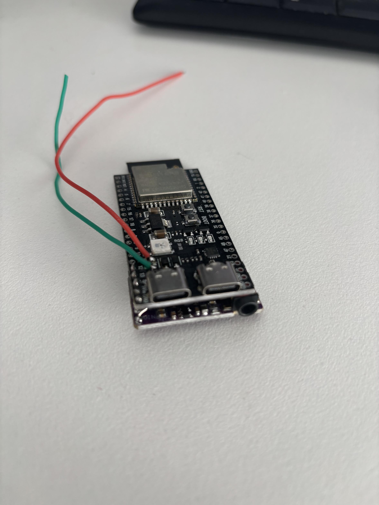
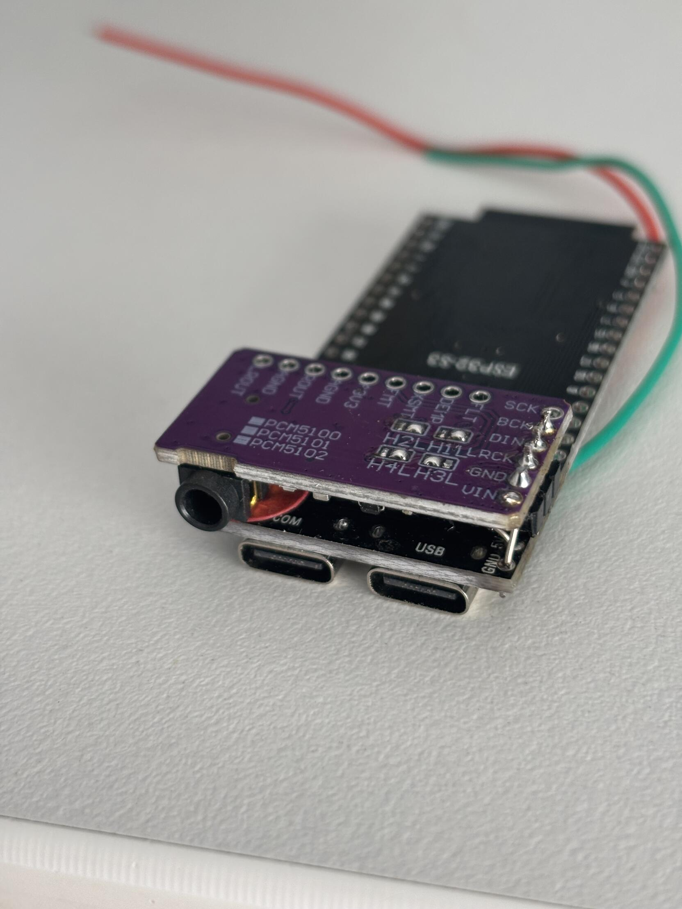
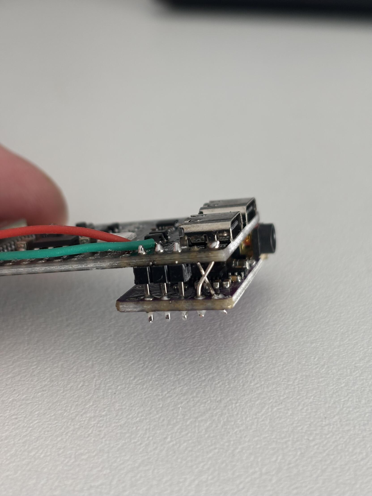
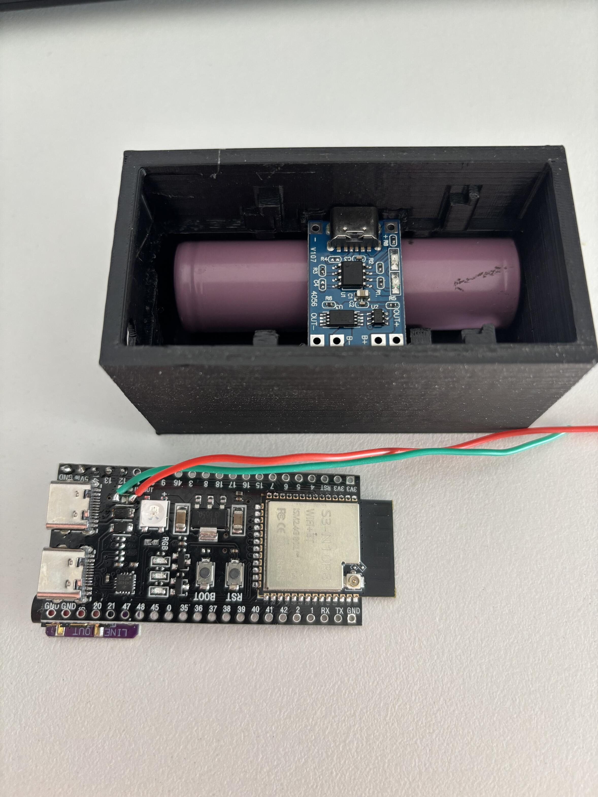
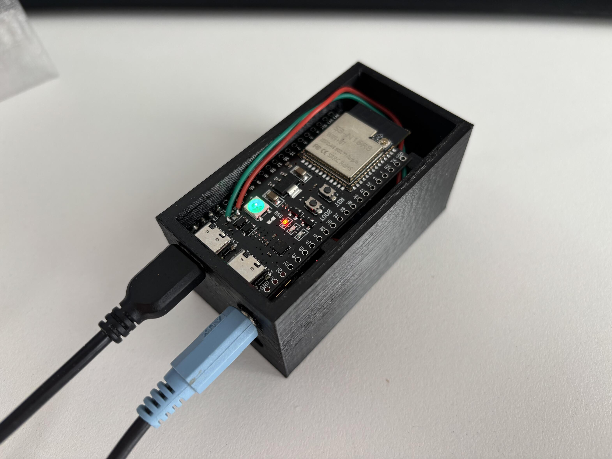
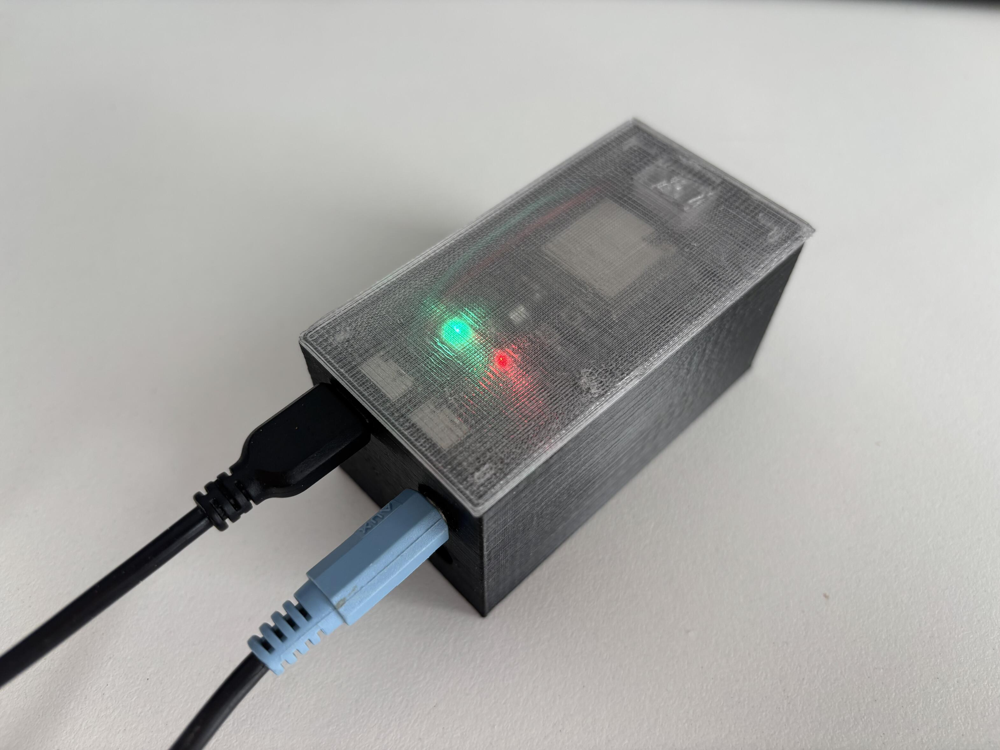
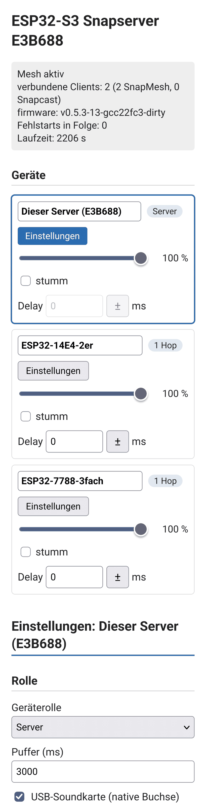
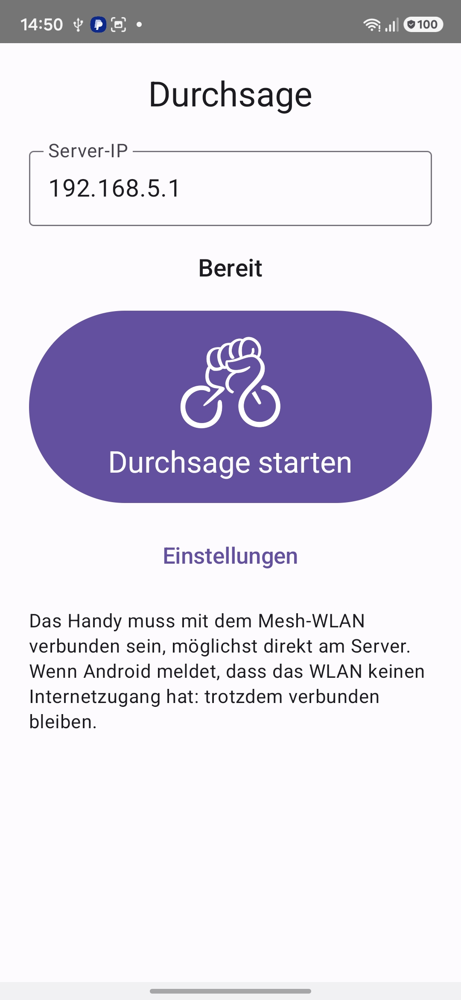
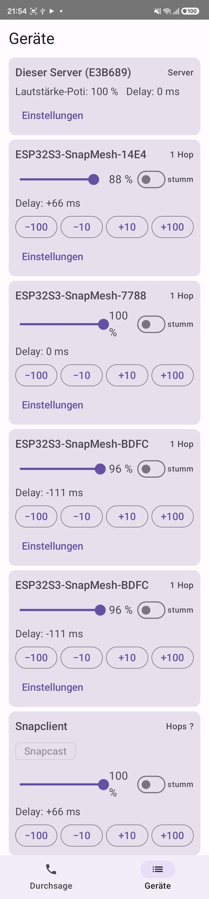

<picture>
  <source media="(prefers-color-scheme: dark)" srcset="docs/logo/snapmesh-logo-dark.svg">
  
</picture>

# ESP32-S3 Mesh Snapserver

**Stand:** 2026-09-29 · **English:** [README.en.md](README.en.md)

Mehrere Lautsprecher spielen synchron dieselbe Musik, ohne Router, PC oder Kabel dazwischen. Die ESP32-S3 bauen sich
ihr eigenes Funknetz (ESP-Mesh-Lite) und reichen das Signal von Gerät zu Gerät weiter.

Damit könnt ihr:

* eine Quelle einspeisen und überall hören,
* Lautstärke und Verzögerung für jeden Lautsprecher einzeln einstellen,
* Durchsagen vom Handy machen,
* einen Subwoofer über die eingebaute Weiche anschließen,
* vorhandene Snapcast-Clients (PC, Android, iOS) und Snapcast-Apps mitnutzen.

Im Kern stecken zwei Funktionen, die sich eigentlich widersprechen: **Musik** soll ohne Aussetzer laufen und bekommt
dafür einige Sekunden Puffer. **Durchsagen** sollen sofort zu hören sein (keine Latenz). Ich habe es
auf ~90 ms runtergeschafft.

Alle Geräte haben dieselbe Firmware. Eins ist der **Server**, alle anderen sind **Clients**.

---

## Installation

Firmware und App liegen fertig unter [Releases](https://github.com/pillepalle127/ESP32S3_Mesh_Snapserver/releases).
Geflasht wird aus dem Browser, eine Entwicklungsumgebung ist nicht nötig.

**Benötigt:** ein ESP32-S3-Board je Standort mit mindestens 4 MB Flash und **Octal-PSRAM** (z. B. N16R8, N8R8), ein
USB-Kabel mit Datenleitungen und Chrome oder Edge am PC. Für die App ein Android-Handy.

### 1. Firmware aufspielen

1. **[Flash-Seite](https://pillepalle127.github.io/ESP32S3_Mesh_Snapserver/)** öffnen, Board anschließen (bei zwei
   Buchsen die mit „USB“).
2. **Installieren**, „USB JTAG/serial debug unit“ wählen, **Verbinden**.
3. **Bei Updates „Erase device“ nicht anhaken**, sonst sind die Einstellungen weg.

Taucht das Board nicht auf: anderes Kabel, oder BOOT halten und kurz RST drücken. Ohne Chrome geht es mit
[esptool](https://github.com/espressif/esptool/releases) und den Einzeldateien aus dem Release:
```bash
esptool --chip esp32s3 --before usb_reset write_flash 0x0 bootloader.bin 0x8000 partition-table.bin 0x10000 snapmesh-app.bin 0x3d0000 ota_data_initial.bin
```

### 2. Einrichten

1. Mit dem offenen WLAN **`ESP32_provisioning_…`** verbinden und **http://192.168.5.1/** öffnen.
2. Rolle, Mesh-Name und Passwort eintragen (auf allen Geräten gleich), **Save**.

Erst den Server einrichten, dann die Clients. Mehr unter [Web-UI](#web-ui).

### 3. App (Android)

**`SnapAnnounce-….apk`** vom [Release](https://github.com/pillepalle127/ESP32S3_Mesh_Snapserver/releases) aufs Handy
laden und installieren. Handy ins Mesh-WLAN, App öffnen, fertig.

---

## Hardware

Zwei Aufbauten laufen bei mir:

* **Komplettsystem** im Verstärker: PCM5102A als Ausgang, TinySine AudioB I2S V2r0 als Bluetooth-Eingang, der über
  einen Pegelwandler TXB0104 am ESP hängt.
* **[SnapStreamer](#bauvorschlag-snapstreamer):** ein Bauvorschlag für einen reinen Empfänger mit PCM5102A.

Geeignet ist jeder ESP32-S3 mit mindestens 4 MB Flash, Octal-PSRAM und USB-Serial/JTAG, zum Beispiel ein
YD-ESP32-S3 N16R8
([Schaltplan V1.4](https://github.com/vcc-gnd/YD-ESP32-S3/blob/main/5-public-YD-ESP32-S3-Hardware%20info/YD-ESP32-S3-SCH-V1.4.pdf)).
Zwei 10-kΩ-Potis sind optional. Als Status-LED dient die WS2812, die auf vielen Boards schon sitzt. Die
Standardbelegung könnt ihr ändern (siehe [Pins](#pins)):

| GPIO | Funktion |
|---|---|
| 12 | BCLK (PCM5102A BCK, TinySine BCLK) |
| 14 | LRCLK (PCM5102A LCK, TinySine LRCLK) |
| 11 | DIN ← TinySine DOUT |
| 13 | DOUT → PCM5102A DIN |
| 10 | Lautstärke-Poti (Schleifer) |
| – | Delay-Poti (Vorgabe: keiner) |
| – | Ein/Aus-Taster gegen GND (Vorgabe: keiner) |
| 48 | WS2812-Status-LED |

---

## Bauvorschlag: SnapStreamer

Ihr habt einen Verstärker oder Aktivlautsprecher und wollt ihn ins Mesh holen? Der SnapStreamer ist meine Idee
dazu: ESP32-S3, DAC und Akku so dicht wie möglich in einem kleinen Gehäuse. Schrumpfschlauch oder ein vorhandenes
Gehäuse tun es natürlich auch.

<table>
  <tr>
    <td valign="top"></td>
    <td valign="top"></td>
    <td valign="top"></td>
  </tr>
</table>

Der PCM5102A sitzt über kurze Stiftleisten direkt unter dem ESP32-S3-Board. Die LEDs bleiben sichtbar, RST und
BOOT erreichbar, Klinke und USB-Buchsen liegen auf einer Ebene an einer Stirnseite. GND und VIN müssen dabei
gekreuzt werden (in der Seitenansicht als X zu sehen).

Die rote und grüne Leitung (optional) führen die 5 V der ESP-Buchse zum TP4056: eine Buchse zum Programmieren und
Laden. Ladestrom auf 500 mA gesenkt (Verlustleistung). Der Akku hängt an VIN, nicht an 3V3: Die Zelle hat bis 4,2 V,
der ESP verträgt max. 3,6 V. Die Alternative wäre ein Buck-Boost-Wandler. Ein Poti mit Schalter schaltet ein und
regelt die Lautstärke.

> [!WARNING]
> Li-Ionen-Akkus können brennen, wenn sie kurzgeschlossen, beschädigt oder falsch geladen werden. Nehmt nur Zellen
> und Lademodule mit Schutzschaltung, isoliert offene Kontakte, quetscht die Zelle nicht ins Gehäuse und ladet nicht
> unbeaufsichtigt.

### Stückliste

| Teil | Typ / Hinweis | Anzahl |
|---|---|---|
| ESP32-S3-Board | ≥ 4 MB Flash, Octal-PSRAM, z. B. YD-ESP32-S3 N16R8 | 1 |
| WLAN-Antenne | optional, 2,4 GHz mit U.FL-Kabel; nur für Boards mit U.FL-Anschluss, verbessert mit guter Antenne den Empfang | 1 |
| DAC-Modul | PCM5102A mit 3,5-mm-Klinkenbuchse | 1 |
| Lademodul | TP4056 mit Schutzschaltung (DW01) | 1 |
| Akku | 18650 Li-Ion mit Zellkontakten | 1 |
| Poti mit Schalter | 10 kΩ linear (B10K), Schalter für die Versorgung, mit Drehknopf | 1 |
| Gehäuse | 3D-Druck: Unterteil (PETG), Deckel (PETG transparent) | 1 |

### Gehäuse



<table>
  <tr>
    <td valign="top"></td>
    <td valign="top"></td>
  </tr>
</table>

Unten im Gehäuse liegen Akku und Lademodul, darüber die Platine. USB-C und Klinke sind von der Stirnseite zugänglich,
die Steckkräfte werden ins Gehäuse geführt. Die Status-LED scheint durch den Deckel. Die Konstruktionsdaten
liegen in [`mechanics/housing/`](mechanics/housing/): das FreeCAD-Modell `Snapstreamer2.FCStd` sowie Unterteil
(`Snapstreamer2-SStreamer GuT.3mf`) und Deckel (`Snapstreamer2-SStreamer GoT.3mf`) druckfertig als 3MF.

---

## Signalweg

```text
I2S in (Stereo) ─► L+R → Mono ─┬─► Opus ─► Snapcast TCP 1704 ─► Clients
                               │
                               └─► Delay-Line ─► DSP ─► I2S out
```

Der Server verzögert seinen eigenen Lautsprecher um die Pufferzeit, damit er mit den Clients zusammen spielt. Die
Clients spielen aus ihrem Puffer in dieselbe Kette.

| Stufe, in Reihenfolge | Weiche aus | Weiche an | Durchsage |
|---|---|---|---|
| Puffer, Delay, Delay-Poti | X | X | - |
| Mono (L+R)/2 | X | X | - |
| Subsonic-Hochpass | - | X | X |
| Gain Sub / Breitband | - | X | X |
| Sub-Phase 180° | - | X | X |
| Kompressor | X | X | - |
| Poti, Lautstärke | X | X | X |
| Begrenzer −0,5 dBFS, 1,3 ms Vorausschau | X | X | X |

**X** verfügbar, **-** nicht verfügbar.

Nur Puffer, Delay und die Vorausschau des Begrenzers (1,3 ms) verzögern. Durchsagen umgehen alles, was
verzögert.

---

## Synchronisation

Die Clients gleichen ihre Uhr laufend mit dem Server ab und spielen jeden Block zu seiner Soll-Zeit. Die Uhr ergibt
sich aus einer Ausgleichsgeraden durch die schnellsten Messungen der letzten 64 s. Kleine Abweichungen gleicht ein
Resampler aus. Korrigiert der Server seine Zeitachse, springen alle Clients beim selben Block. Bei mir liegen die
Lautsprecher damit unter 2–3 ms beieinander.

---

## Netzwerk

Die Geräte nutzen die Ports 80, 1704, 1705 und 1706 (UDP). Die Clients bauen alle Verbindungen selbst auf, so
erreichen sie den Server aus jeder Mesh-Ebene. Per mDNS heißen die Geräte `snapserver-<MAC>.local` bzw.
`snapclient-<MAC>.local`.

Ohne Konfiguration, nach einem Factory Reset oder wenn das Mesh wiederholt nicht zustande kommt, öffnet das Gerät das
WLAN `ESP32_provisioning_<MAC>` zum Einrichten. Nach 3 Minuten ohne Speichern schaltet es den Funk ab.

---

## Web-UI



Jedes Gerät hat eine Einstellungsseite unter seiner IP-Adresse oder seinem mDNS-Namen. Die Werte bleiben bei
Updates erhalten, **Werkseinstellungen** setzt alles zurück.

### Geräteliste (Server)

Name, Lautstärke, Stumm und Delay jedes Lautsprechers, auch aus Snapcast-Control-Apps. Der Server merkt sich die
Werte je Gerät. **Einstellungen** lädt die Einstellungen eines Clients, egal wie tief er im Mesh hängt.

### Einstellungen

* **Rolle:** Server oder Client.
* **Puffer (Server):** Vorsprung gegen Funkaussetzer, Vorgabe 3000 ms, gilt für alle Geräte.
* **Wiedergabe (Client):** Quelle, Lautstärke und Stumm. Solange ein Server verbunden ist, stellt er die Lautstärke ein.
* **Mesh / WLAN:** Name, Passwort und Kanal, auf allen Geräten gleich.
* **Weiche:** Trennfrequenz, Gain für Sub und Breitband (−24 bis +18 dB), Sub-Phase 180°.
* **Subsonic:** Hochpass im Sub-Zweig gegen Tiefbass unterhalb der Abstimmung, Richtwert 0,75 × F3.
* **Kompressor:** Schwelle, Verhältnis, Aufholen.
* **Pins:** siehe [Pins](#pins).
* **Opus (Server):** Bitrate und Rechenaufwand des Encoders, eingeklappt.

Weiche, Kompressor und Lautstärke werden beim Ändern übernommen, alles andere mit **Speichern**. Rolle, Mesh, Puffer und Pins
starten das Gerät neu. Die Pins sind eingeklappt.

### Kompressor einstellen

1. Sub und Breitband mit den Gains abgleichen, den lauteren Zweig auf 0 dB. Poti und Quelle auf Maximum.
2. Kompressor an, Verhältnis 3, Aufholen 0 dB.
3. Schwelle ab −30 dBFS senken, bis laute Stellen um 3–6 dB abgesenkt werden.
4. Aufholen erhöhen, bis der Begrenzer nur noch selten eingreift, höchstens um 3 dB.
5. Poti durchdrehen: Das letzte Stück muss noch lauter werden, sonst ist das Aufholen zu hoch.

Klingt es platt oder pumpt es, die Schwelle höher oder das Verhältnis kleiner stellen. Mit 1:1 ist der Kompressor
eine reine Verstärkung. Kompressor und Begrenzer melden ihre Absenkung alle 5 s im seriellen Log.

---

## Pins

Die Pins lassen sich in der Web-UI umbelegen, ohne neu zu flashen. Die Firmware lehnt Doppelbelegungen und
ungeeignete Pins ab. Startet das Gerät mit einer neuen Belegung nicht, fällt es auf die Standardbelegung zurück.

### I2S-Takt

Normal erzeugt der ESP BCLK und LRCLK. Gibt ein anderes Gerät den Takt vor, zum Beispiel ein DSP wie der ADAU1701,
stellt ihr **I2S-Takt** auf **Extern**. Dann laufen Quelle, DAC und ESP auf dessen Takt. Ohne diesen Takt bleibt es
still.

### Ein/Aus-Taster

Ein Taster von einem GPIO (1–21) gegen GND, ohne weitere Bauteile. 2 s halten schaltet aus, 1 s halten schaltet ein.
Aus heißt Deep Sleep: Nur der ESP schläft, DAC, Verstärker und Spannungsregler am Akku ziehen weiter Strom.

### Potis

Zwei optionale 10-kΩ-Potis regeln Lautstärke und Delay direkt am Gerät. Der Schleifer gehört an einen ADC1-Pin
(GPIO 1–10). Die Drehrichtung lässt sich umkehren.

### Status-LED

Eine WS2812 blitzt beim Start rot, grün und blau und zeigt danach den Zustand:

| Anzeige | Bedeutung |
|---|---|
| blau, blinkt langsam | Einrichtung |
| rot, blinkt schnell | kein Netz |
| orange, blinkt | kein Server |
| Pegel grün bis rot | Wiedergabe |
| Pegel, pulsiert | Durchsage |

<br clear="all">

---

## SnapAnnounce App


Mit **SnapAnnounce** startet ihr Durchsagen direkt im Mesh. Ohne extra Hardware und ohne Kabel, alles übers Handy.
Leider nur für Android, ich habe keinen Mac und kaufe mir auch keinen.

Die Musik pausiert solange. Weil Durchsagen ohne Puffer laufen, sind sie empfindlicher gegen Funkaussetzer und
reichen deshalb **nur zwei Mesh-Ebenen** tief.

<table>
  <tr>
    <td valign="top"></td>
    <td valign="top"></td>
  </tr>
</table>

---

## Lizenz

MIT, siehe [LICENSE](LICENSE). Die Lizenzen der Fremdkomponenten liegen jedem Release als
`THIRD_PARTY_LICENSES.txt` bei.
