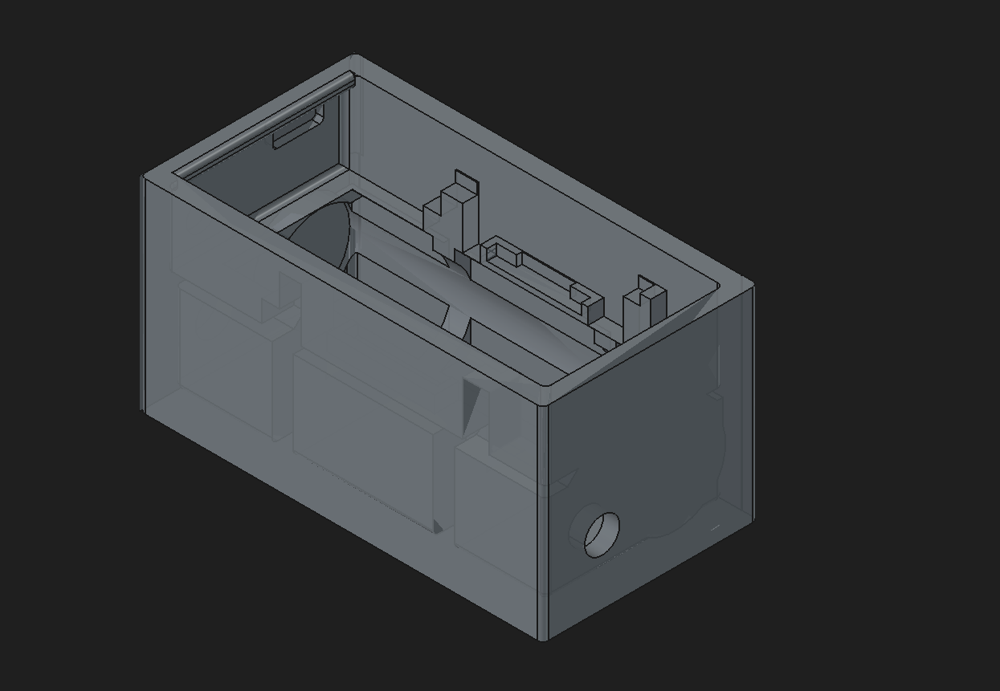

<picture>
  <source media="(prefers-color-scheme: dark)" srcset="docs/logo/snapmesh-logo-dark.svg">
  
</picture>

# ESP32-S3 Mesh Snapserver

**Stand:** 2026-09-26

Mehrere Lautsprecher spielen synchron dieselbe Musik, ohne Router, PC oder Kabel dazwischen. Die ESP32-S3 bauen sich
ihr eigenes Funknetz (ESP-Mesh-Lite) und reichen das Signal von Gerät zu Gerät weiter.

Damit könnt ihr:

* eine Quelle einspeisen und überall hören,
* Lautstärke und Verzögerung für jeden Lautsprecher einzeln einstellen,
* Durchsagen vom Handy machen,
* einen Subwoofer über die eingebaute Weiche anschließen,
* vorhandene Snapcast-Clients (PC, Android, iOS) und Snapcast-Apps mitnutzen.

Alle Geräte haben dieselbe Firmware. Eins ist der **Server**: Er nimmt die Musik per I2S auf, packt sie in Opus und
verteilt sie per Snapcast. Alle anderen sind **Clients**: Sie spielen ab und reichen das Netz weiter. Ein Client kann
auch einen eigenen I2S-Eingang haben, zum Beispiel Bluetooth.

---

## Installation

Firmware und App liegen fertig gebaut unter
[Releases](https://github.com/pillepalle127/ESP32S3_Mesh_Snapserver/releases). Die Firmware lässt sich aus dem
Browser aufspielen, die App ist eine normale APK. Eine Entwicklungsumgebung ist nicht nötig.

**Benötigt:**

* **ein ESP32-S3-Board je Standort** mit **mindestens 4 MB Flash und Octal-PSRAM**, etwa „N16R8“ oder „N8R8“
  (z. B. YD-ESP32-S3 N16R8). Mit Quad-PSRAM oder ohne PSRAM startet die Firmware nicht.
* **ein USB-Kabel mit Datenleitungen**, reine Ladekabel reichen nicht,
* **ein PC mit Chrome oder Edge** (Windows, macOS oder Linux); Firefox, Safari und Handys können nicht flashen,
* für die App ein **Android-Handy** ab Android 8. Auf dem iPhone gehen die Einstellungen im Browser.

### 1. Firmware aufspielen

1. Die **[Flash-Seite](https://pillepalle127.github.io/ESP32S3_Mesh_Snapserver/)** in Chrome oder Edge öffnen.
2. Das Board anschließen. Bei zwei USB-Buchsen die am ESP32-S3 nehmen (meist „USB“, nicht „COM“ oder „UART“).
3. **Installieren** klicken, **„USB JTAG/serial debug unit“** wählen, **Verbinden**.
4. Bei einem neuen Board darf „Erase device“ gesetzt sein. **Bei einem Update „Erase device“ nicht anhaken**, sonst
   gehen die Einstellungen verloren.
5. Etwa eine Minute warten, das Kabel stecken lassen. Nach „Installation complete“ startet das Board neu.

Erscheint das Board nicht in der Liste, hilft meist ein anderes Kabel oder die andere Buchse. Sonst **BOOT**
gedrückt halten, kurz **RST** drücken und BOOT loslassen. Unter Linux muss der Benutzer in der Gruppe `dialout` sein.

### 2. Neues Gerät einrichten

1. Mit dem offenen WLAN **`ESP32_provisioning_…`** verbinden, auch wenn das Handy „kein Internet“ meldet.
2. **http://192.168.5.1/** öffnen, Rolle, Mesh-Name und Passwort eintragen (auf allen Geräten gleich), **Save**.

Am besten erst den Server einrichten, dann die Clients. Die tauchen danach in der Geräteliste des Servers auf. Was die
Seite sonst noch kann, steht unter [Web-UI](#web-ui).

### 3. Updates

Wie Schritt 1, nur **ohne „Erase device“**. Jedes Gerät wird einzeln per USB aktualisiert, die Einstellungen bleiben
erhalten. Die installierte Version steht im Statusfeld (`firmware: v…`).

### 4. App installieren (Android)

1. Auf dem Handy **`SnapAnnounce-….apk`** von der
   [Release-Seite](https://github.com/pillepalle127/ESP32S3_Mesh_Snapserver/releases) laden und öffnen. Die
   Nachfrage, ob der Browser Apps installieren darf, mit **Erlauben** beantworten.
2. Das Handy ins Mesh-WLAN bringen und die App öffnen. Die Server-Adresse `192.168.5.1` ist voreingestellt.
   * **Durchsage:** Knopf drücken und sprechen, zum Beenden erneut drücken.
   * **Geräte:** Lautstärke, Stummschaltung und Verzögerung aller Lautsprecher. **Einstellungen** öffnet die
     Konfiguration eines Geräts.

Die App fragt nach Mikrofon und ab Android 13 nach Benachrichtigungen, beides braucht sie für Durchsagen. Eine
selbst gebaute Version vorher deinstallieren, sonst lehnt Android das Update ab.

### Alternativ: Flashen mit esptool

Ohne Chrome oder Edge geht es mit dem eigenständigen [esptool](https://github.com/espressif/esptool/releases), das
kein Python braucht, und den vier Dateien aus dem Release:
```bash
esptool --chip esp32s3 --before usb_reset write_flash 0x0 bootloader.bin 0x8000 partition-table.bin 0x10000 snapmesh-app.bin 0x3d0000 ota_data_initial.bin
```
`snapmesh-full.bin` ist ein Gesamt-Image ab `0x0` für Neuinstallationen, es löscht die Einstellungen.

---

## Hardware

Zwei Aufbauten laufen bei mir:

* **Komplettsystem** im Verstärker: PCM5102A als Ausgang, TinySine AudioB I2S V2r0 als Bluetooth-Eingang, der über
  einen Pegelwandler TXB0104 am ESP hängt (siehe [Module an den Schnittstellen](#module-an-den-schnittstellen)).
* **[SnapStreamer](#bauvorschlag-snapstreamer):** ein Bauvorschlag für einen reinen Empfänger mit PCM5102A.

Geeignet ist jeder ESP32-S3 mit mindestens 4 MB Flash, Octal-PSRAM und USB-Serial/JTAG, zum Beispiel ein
YD-ESP32-S3 N16R8
([Schaltplan V1.4](https://github.com/vcc-gnd/YD-ESP32-S3/blob/main/5-public-YD-ESP32-S3-Hardware%20info/YD-ESP32-S3-SCH-V1.4.pdf)).
Zwei 10-kΩ-Potis sind optional. Als Status-LED dient die WS2812, die auf vielen Boards schon sitzt. Die
Standardbelegung könnt ihr ändern (siehe [Pins](#pins)):

| GPIO | Funktion |
|---|---|
| 4 | BCLK (PCM5102A BCK, TinySine BCLK) |
| 6 | LRCLK (PCM5102A LCK, TinySine LRCLK) |
| 5 | DIN ← TinySine DOUT |
| 7 | DOUT → PCM5102A DIN |
| 10 | Lautstärke-Poti (Schleifer) |
| – | Delay-Poti (Vorgabe: keiner) |
| 48 | WS2812-Status-LED |

---

## Bauvorschlag: SnapStreamer

Ihr habt einen Verstärker oder Aktivlautsprecher und wollt ihn ins Mesh holen? Der SnapStreamer ist meine Idee
dazu: ESP32-S3, DAC und Akku so dicht wie möglich in einem kleinen Gehäuse. Schrumpfschlauch oder ein vorhandenes
Gehäuse tun es natürlich auch.


Der PCM5102A sitzt über kurze Stiftleisten direkt unter dem ESP32-S3-Board. Die LEDs bleiben sichtbar, RST und
BOOT erreichbar, Klinke und USB-Buchsen liegen auf einer Ebene an einer Stirnseite. GND und VIN müssen dabei
gekreuzt werden (in der Seitenansicht als X zu sehen).

Die rote und die grüne Leitung sind optional. Sie führen die 5 V der USB-Buchse am ESP zum Lademodul TP4056. So
lässt sich über diese eine Buchse programmieren und der Akku laden, auch bei ausgeschaltetem ESP. Die Buchse des
Lademoduls wird nicht gebraucht. Den Ladestrom des TP4056 habe ich auf 500 mA gesenkt,
um die Verlustleistung zu begrenzen. Ein **Poti mit Schalter** schaltet den ESP und regelt die Lautstärke (siehe
[Potis](#potis)).

> [!WARNING]
> Li-Ionen-Akkus können brennen, wenn sie kurzgeschlossen, beschädigt oder falsch geladen werden. Nehmt nur Zellen
> und Lademodule mit Schutzschaltung, isoliert offene Kontakte, quetscht die Zelle nicht ins Gehäuse und ladet nicht
> unbeaufsichtigt.

### Stückliste

| Teil | Typ / Hinweis | Anzahl |
|---|---|---|
| ESP32-S3-Board | ≥ 4 MB Flash, Octal-PSRAM, mit U.FL-Anschluss, z. B. YD-ESP32-S3 N16R8 | 1 |
| WLAN-Antenne | 2,4 GHz mit U.FL-(IPEX-)Kabel | 1 |
| DAC-Modul | PCM5102A mit 3,5-mm-Klinkenbuchse | 1 |
| Lademodul | TP4056 mit Schutzschaltung (DW01), USB-C | 1 |
| Akku | 18650 Li-Ion mit Zellkontakten | 1 |
| Poti mit Schalter | 10 kΩ linear (B10K), Schalter für die Versorgung, mit Drehknopf | 1 |
| Gehäuse | 3D-Druck: Unterteil (PETG), Deckel (PETG transparent) | 1 |

### Gehäuse




Unten im Gehäuse liegen Akku und Lademodul, darüber die Platine. USB-C und Klinke sind von der Stirnseite
zugänglich, die Status-LED scheint durch den Deckel. Die Konstruktionsdaten liegen in
[`mechanics/housing/`](mechanics/housing/): das FreeCAD-Modell `Snapstreamer2.FCStd` sowie Unterteil
(`Snapstreamer2-SStreamer GuT.3mf`) und Deckel (`Snapstreamer2-SStreamer GoT.3mf`) druckfertig als 3MF.

---

## Module an den Schnittstellen

### Ausgang: PCM5102A

Der Line-Ausgang (2,1 V<sub>eff</sub>) passt direkt an übliche Endstufen, etwa den TPA3255, auch an mehrere
parallel. Am Modul FMT auf GND und XSMT auf High legen; SCK bleibt frei, der Takt entsteht intern aus BCK.

### Eingang: TinySine AudioB I2S

Bluetooth-Empfänger mit aptX, klingt gut. Er läuft als I2S-Slave am Takt des ESP. Seine I2S-Pegel liegen
bei 1,8 V, direkt am ESP32-S3 rauscht und knackst es deshalb. Abhilfe schafft ein TXB0104 dazwischen (VCCA 1,8 V vom
TinySine, VCCB 3,3 V vom ESP). Am ADAU1701 läuft er auch ohne.

---

## Signalweg

```text
I2S in (Stereo) ─► L+R → Mono ─┬─► Opus ─► Snapcast TCP 1704 ─► Clients
                               │
                               └─► Delay-Line (bufferMs + trim) ─► LR4 ─► Low/High ─► Gain/Vol ─► I2S out
```

Der Server verzögert seinen eigenen Lautsprecher um die Pufferzeit, damit er mit den Clients zusammen spielt.

---

## Synchronisation

Die Clients gleichen ihre Uhr laufend mit dem Server ab und spielen jeden Block zu seiner Soll-Zeit. Kleine
Abweichungen gleicht ein Resampler aus, große ein harter Sprung. Der Regelfehler liegt bei wenigen Millisekunden.

---

## Netzwerk

| Port | Proto | Zweck |
|---|---|---|
| 80 | TCP | Web-UI, JSON-API |
| 1704 | TCP | Snapcast-Stream und Konfiguration der Clients |
| 1705 | TCP | Snapcast JSON-RPC |
| 1706 | UDP | Durchsagen |

Die Clients bauen alle Verbindungen selbst auf, so erreichen sie den Server aus jeder Mesh-Ebene. Per mDNS heißen die
Geräte `snapserver-<MAC>.local` bzw. `snapclient-<MAC>.local`.

Ohne Konfiguration, nach einem Factory Reset oder wenn das Mesh wiederholt nicht zustande kommt, öffnet das Gerät das
WLAN `ESP32_provisioning_<MAC>` zum Einrichten. Nach 3 Minuten ohne Speichern schaltet es den Funk ab.

---

## Web-UI


Jedes Gerät hat eine Einstellungsseite unter seiner IP-Adresse oder seinem mDNS-Namen. Die Werte bleiben bei
Updates erhalten, **Factory Reset** setzt alles zurück.

### Geräteliste (Server)

Name, Lautstärke, Stumm und Delay jedes Lautsprechers, auch aus Snapcast-Control-Apps. Der Server merkt sich die
Werte je Gerät. **Settings** lädt die Einstellungen eines Clients, egal wie tief er im Mesh hängt.

### Einstellungen

* **Rolle:** Server oder Client.
* **Wiedergabe (Client):** Quelle, Puffer (Vorgabe 3000 ms), Delay-Trim.
* **Mesh / WLAN:** Name, Passwort und Kanal, auf allen Geräten gleich.
* **Weiche:** Trennfrequenz und Verstärkung für Sub und Breitband.
* **Pins:** siehe [Pins](#pins).
* **Opus:** Bitrate und Rechenaufwand des Encoders.

Änderungen an Rolle, Mesh oder Pins starten das Gerät neu.

---

## Pins

Die Pins lassen sich in der Web-UI umbelegen, ohne neu zu flashen. Die Firmware lehnt Doppelbelegungen und
ungeeignete Pins ab. Startet das Gerät mit einer neuen Belegung nicht, fällt es auf die Standardbelegung zurück.

### Potis

Zwei optionale 10-kΩ-Potis regeln Lautstärke und Delay direkt am Gerät. Der Schleifer gehört an einen ADC1-Pin
(GPIO 1–10).

### Status-LED

Eine WS2812 blitzt beim Start rot, grün und blau und zeigt danach den Zustand:

| Anzeige | Bedeutung |
|---|---|
| blau, blinkt langsam | Einrichtung |
| rot, blinkt schnell | kein Netz |
| orange, blinkt | kein Server |
| Pegel grün bis rot | Wiedergabe |
| Pegel, pulsiert | Durchsage |

<br clear="all">

---

## Sprachdurchsagen

Mit **SnapAnnounce** startet ihr Durchsagen direkt im Mesh. Ohne extra Hardware und ohne Kabel, alles übers Handy.
Leider nur für Android, ich habe keinen Mac und kaufe mir auch keinen.

Die Musik pausiert solange. Sie läuft mit einigen Sekunden Puffer, die Durchsage umgeht ihn und ist nach **etwa
90 ms** zu hören. Dafür ist sie empfindlicher gegen Funkaussetzer und reicht deshalb **nur zwei Mesh-Ebenen** tief.


---

## Build

Firmware mit ESP-IDF 5.4.x:

```bash
idf.py set-target esp32s3
idf.py build
idf.py -p PORT flash monitor
```

Die Konfiguration steht in `sdkconfig.defaults`, Änderungen aus `menuconfig` gehören dort hinein.

App mit Gradle 8.13 und JDK 21 oder in Android Studio:

```bash
cd android/SnapAnnounce
gradle assembleDebug
```

---

## Status

Stabil laufen Streaming und Synchronisation über das Mesh, die Weiche, der Rollenwechsel, die Web-Oberfläche und
die Durchsagen. Offene Punkte stehen in [TODO.md](TODO.md).

---

## Haftungsausschluss

Dies ist ein privates Bastelprojekt. Firmware, App und Anleitungen gibt es kostenlos und **ohne jede Gewähr**
([MIT-Lizenz](LICENSE)), die Nutzung erfolgt **auf eigene Verantwortung**. Soweit gesetzlich zulässig, hafte ich
nicht für Schäden durch Nachbau, Installation oder Betrieb, etwa an Boards, Lautsprechern, Verstärkern oder anderen
Geräten, für Datenverlust oder Folgeschäden.

## Abhängigkeiten und Lizenz

ESP-IDF, ESP-Mesh-Lite, ESP-IoT-Bridge, ESP-Modem, ESP-mDNS und CMake Utilities stehen unter Apache 2.0, esp-opus
unter MIT. Drittkomponenten unterliegen ihren eigenen Lizenzen. Dieses Projekt steht unter der MIT License.
